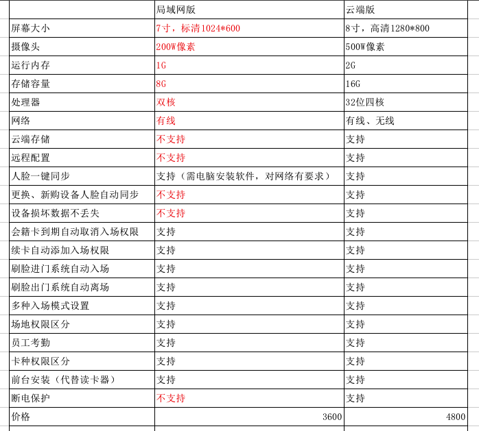

## 为什么一定要选择阿懒的人脸识别门禁系统？

### 为什么一定要使用生物识别门禁系统？

健身房作为一个公共场所，采用预付费的会员模式，首先要解决生物识别的问题，即：要证明会员是否是会员本人：

1. 验证会员是否是其本人
2. 验证会员的会员卡是否到期
3. 验证会员的次卡是否用完
4. 验证会员的时段卡是否在相应的时段
5. 验证会员是否预约
6. 验证会员的卡种，是否支持门店
7. 验证会员是否有权限进入相应区域，区分私教区、团课区、游泳馆等

这一系列的验证工作，给前台客服带来很大的工作压力，造成前台拥堵，同时也让会员感到处处被查验的不爽的感觉。

于是，自动化的生物识别门禁系统运用而生，不但解决的以上的人工查验的问题，也让会员自助、自由的健身，同时至少可以减少一名客服，省去了很大的人力成本（算算一个前台一年要多少钱？）。

### 生物识别为什么一定要选择人脸识别？

生物识别有多种，指纹、指静脉、人脸识别，为什么一定选择人脸生物识别呢？

指纹识别：指纹是使用人类手指末端由凹凸的皮肤所形成的纹路进行个体识别，它的优势是成本比较低，无需成像、无需屏幕、所需元件少。缺点也很明显：1、需要指纹采集，2、指纹理论上独一无二的，但因为算法精度的缺陷，误识率高，3、一定比例的人的指纹特征少，难以成像，识别非常困难。4、受汗水、潮湿、干燥皮肤等影响，导致指纹无法识别的几率非常高。

指静脉识别：静脉识别的优势是无法伪造、高度防伪。但这个优势只适合保密要求非常高的机密场所才需要，并不适合公共场所。健身房的防伪要求没达到这个级别。指静脉识别的最大缺陷是1:N搜索的性能特别低。生物识别有两种典型应用，一种是生物比对，简单说就是证明你真的是你，属于1:1比对。另一种应用是生物搜索，简单说，找出来你是谁，这属于1:N搜索，N的大小，直接决定了搜索成功的效率。指静脉识别的最大问题就是N超过500的时候，性能大幅下降，无法满足日常应用。所以市场上经常看到的指静脉应用流程是，先输入自己的手机号，然后指静脉认证，这就是为了把1:N简化成1:1，但这种简化是以损失用户体验为代价的，不再有应用价值。

人脸识别：人脸识别是基于人的脸部特征信息进行身份识别的一种生物识别技术。现在市场上的智能手机均全部从指纹识别转向了人脸识别。人脸识别具有非常明显的优势：1、非强制约束性，刷人脸不像刷指纹那样，具有约束性，对人的骚扰小。2、非接触性，人不需要把自己的某个肢体放到一个仪器中。3、快速通过性，无需停下来专门进行认证操作，可以边走边识别，通过效率非常高。这也是高铁站等人流密集的场所不会使用指纹，只能使用人脸识别的原因。4、1:N搜索效率高，满足20000以上本地检索，速度在毫秒以内，即使是云端识别，也在秒级的响应速度。

综合来看，人脸识别是生物识别中，最适合健身房这种场景的方案。不是说其他识别方式不好，只是场景不同，每种方式都有最适合它的应用场景。

### 为什么一定要用阿懒的人脸识别？

阿懒对市场上几十款的人脸机做出评测后，发现市场上居然没有一款真正适合健身房场景的人脸机。我们认为，一款能用的人脸识别系统必须具备以下特点：

1. 做工要好。健身房是一个公共运营的场所，设备要能长期不间断的使用，很多塑料壳的，品质貌相都不好以外，散热都不行，频频死机。
2. 速度要快。必须在毫秒级识别响应，满足流量大的情况下，快速通过。
3. 活体识别。不能用照片就糊弄过去了。
4. 数据库要大。最少支持2万人脸数据库。门店会员来来往往，办卡人多，加上员工也要使用，数据库太小，就像手机没有存储空间，都不能拍照了，那就太尴尬了。
5. 能够联网。市场上绝大部分人脸识别机都是局域网的，这就造成馆与馆不通、店与店不通，对于连锁来说，这是重大缺陷，几乎无法使用。
6. 高度智能。我们买个设备，放在那里自己工作就可以了，不需要我们专门研究它、伺候它，一会要重启、一会要重装，一会不工作了，这不但没减轻工作，还带来了额外的负担。
7. 无缝整合。必须能够和系统无缝的、深度的整合。如果买了一款人脸机，还要用人脸机系统加上健身房系统，办理一个会员，要在健身房系统录入一遍，又要在人脸机系统录入一遍，这不是简化了工作，反而是更复杂了。和健身房系统高度整合的人脸机，所有工作都是在健身房系统中自动完成的，数据都是自动同步的。
8. 支持热插拔。店里增加一个人脸机怎么办，更换一个人脸机怎么办，坏到了需要维修怎么办？一个好的人脸机，是支持热插拔，热更换的。就像以前换手机一样，要同步通讯录、拷贝图片、重装各种应用，折腾下来需要好几天的时间，很多人都不愿意换手机，因为太麻烦了，丢手机更可怕，数据尽失！为什么苹果手机好用？因为苹果手机，不管是更换，还是丢失，新的手机可以自动把老的手机的数据完全同步过来。那我们期望的人脸机也需要这样的能力，随便把一台人脸机拔下来，插上一个新的，什么都不用动，新机器就可以自动工作了。

经过不懈的努力和高成本的研发投入，阿懒终于顺利完成了以上所有对人脸机的要求。

### 您以前买的人脸机，其实都是工地用的低端机。

我们很多客户，自己购买的人脸机，都是工地上用的设备。

我们很多客户，自己购买的人脸机，都是工地上用的设备。

我们很多客户，自己购买的人脸机，都是工地上用的设备。

重要的话说三遍，这种低端机，日常应用中，状况百出。为了降低成本，粗制滥造的的机器，只适合工地使用，并不适合健身房这种经营场所、需要给会员良好的用户体验的场景。

为什么会有工地用的人脸机？这是工地上的一个特点造成的：

1. 工地都是工人使用，人流量少，需要的CPU性能不高，对数据库空间要求也不高。
2. 不是高频使用。工地上都是工人上下班考勤用，大部分时间处于闲置状态，所以散热做的都不好，高频使用就会蓝屏。
3. 业务简单。就是考勤用一下，没有复杂的业务逻辑和场景。所以配套的软件极其简单。
4. 设计丑陋。工地上使用，不需要高端大气上档次，不需要阳极氧化铝外壳，不需要8寸大屏幕，不需要触摸屏交互，不需要互联网，不需要考虑功耗。
5. 周期短。工地上灰尘大、环境恶劣，工地周期短，几个月就结束了，不需要买一款高端的机器。

所以为了迎合工地的需求，市场上绝大部分的人脸机都是为工地设计、简化配件、缩减成本的。

我们经常发现使用了这些低端机器的俱乐部，每天都在和机器斗智斗勇，浪费了巨大的精力和时间。

### 阿懒云端人脸识别机

#### 设备参数
  - 金属外壳阳极氧化处理，高端大气
  - 8寸大屏幕
  - 支持有线、无线、4G全网通
  - 支持LED补光
  - 支持韦根、继电、网络等控制信号输出，支持所有门禁、闸机
  - 支持IC、ID卡读取、身份证读取

  

  

#### 功能特点
  - 前台录入一键同步，只需前台配置一个电脑摄像头，会员不需要跑到人脸机前去录入
  - 拍照后系统可一键同步人脸到门店的多台设备中，无需多次录入
  - 云端永久保存高达2万张人脸，毫秒级识别速度
  - 设备更换、新购，人脸数据自动同步
  - 设备损坏人脸数据不丢失，做到数据安全万无一失
  - 会员卡到期自动取消入场权限
  - 续卡后自动增加入场权限，无需额外操作
  - 可以安装在前台实现刷脸入场
  - 远程配置，参数修改不用自己动手，阿懒技术人员远程配置
  - 断电保护，断电后延迟关机，避免损坏设备

### 阿懒局域网人脸机

#### 设备参数

  - 采用200万 F2.0大光圈安防级工业镜头，抗逆光.

  - 7寸ISP全面屏，最高分辨率1024*600，屏幕亮度为450cd/m2，可在环境温度为-30℃～70℃下工作，
湿度小于90%(无凝结)

  - 外玻璃采用钢化玻璃，透光性好，硬度高，不易变形

  - 支持多人脸识别、最大人脸识别模式，人脸识别率高达99.7%以上

  - 人脸底库可存10000张，存储容量：1G运行内存，8G存储空间

  - 支持动态人脸识别，人脸识别速度（1：N）≤0.2S/人

  - 支持门未关超时报警、黑名单报警信号输出等（输出到中心管理软件）

  - 设备配有百兆网口，可选配支持WIFI（需定制）

  - 支持在线、离线两种工作模式

  - 防护等级支持IP67,防爆等级支持IK08

  - 采用海思HI3516DV300高性能AI人脸识别专用芯片，基于深度学习的人脸识别与抓拍信息提取，极大
的提高了人脸抓拍率和识别速度

  - 采用行业领先的旷视人脸识别算法，安全性和识别效率更有保障

  - 支持人脸优选，人脸增强与人脸曝光，提高成像质量

  - 支持活体识别，解决照片欺骗问题

#### 功能特点
  - 前台录入一键同步，只需前台配置一个电脑摄像头，会员不需要跑到人脸机前去录入
  - 拍照后系统可一键同步人脸到门店的多台设备中，无需多次录入（需在电脑安装阿懒开发的软件）
  - 会员卡到期自动取消入场权限
  - 续卡后自动增加入场权限，无需额外操作
  - 可以安装在前台实现刷脸入场

### 对比

### 阿懒人脸机性能好，价格却便宜

作为使用率非常高的场所，我们不推荐我们的健身房客户去使用低端的人脸机，毕竟，这是用来赚钱的。用的不好，就影响了会员体验，造成了门店员工负担。所以，这个不是省钱的地方，坚决不能用差的。

如果你要问阿懒的人脸机为什么这么高端，却还这么便宜？

我只能说：我们是真正把客户当做长期合作伙伴的，我们从来不割自己客户的韭菜！