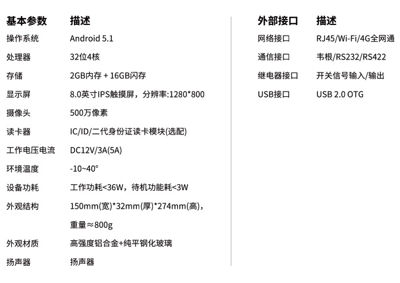

刷脸已经在各种场合广泛使用，俱乐部使用人脸机可以实现会员的自助
入场，减少前台验卡的工作量，避免高峰期会员排队入场，提升会员体验。

阿懒技术团队购买了十几种市场上不同的人脸机，经过大量的测试和实际使用，
挑选出体验最棒的两款人脸机（云端、局域网两款），并与厂商深度合作定制，跟阿懒系统进行了深入对接，
让人脸机结合系统在使用上更加方便，功能更丰富：

  - 进门刷脸，系统中会员自动入场
  - 防止多次入场，系统可设置是否允许多次刷脸入场
  - 出门刷脸，系统中会员自动离场
  - 场地区分，如私教区、团操区、瑜伽室仅限预约会员刷脸进入
  - 卡种区分，如持有游泳卡会员可以刷脸进入泳池区域，
    其他非游泳会员无法刷脸进入
  - 支持员工考勤，员工录入人脸，可实现系统中记录考勤

### 阿懒云端人脸机

#### 设备参数
  - 金属外壳阳极氧化处理，高端大气
  - 8寸大屏幕
  - 支持有线、无线、4G全网通
  - 支持LED补光
  - 支持韦根、继电、网络等控制信号输出，支持所有门禁、闸机
  - 支持IC、ID卡读取、身份证读取
  
  
  
  
  
#### 功能特点
  - 前台录入一键同步，只需前台配置一个电脑摄像头，会员不需要跑到人脸机前去录入
  - 拍照后系统可一键同步人脸到门店的多台设备中，无需多次录入
  - 云端永久保存高达2万张人脸，毫秒级识别速度
  - 设备更换、新购，人脸数据自动同步
  - 设备损坏人脸数据不丢失，做到数据安全万无一失
  - 会员卡到期自动取消入场权限
  - 续卡后自动增加入场权限，无需额外操作
  - 可以安装在前台实现刷脸入场
  - 远程配置，参数修改不用自己动手，阿懒技术人员远程配置
  - 断电保护，断电后延迟关机，避免损坏设备

  
### 阿懒局域网人脸机

#### 设备参数

  - 采用200万 F2.0大光圈安防级工业镜头，抗逆光.

  - 7寸ISP全面屏，最高分辨率1024*600，屏幕亮度为450cd/m2，可在环境温度为-30℃～70℃下工作，
湿度小于90%(无凝结)

  - 外玻璃采用钢化玻璃，透光性好，硬度高，不易变形

  - 支持多人脸识别、最大人脸识别模式，人脸识别率高达99.7%以上

  - 人脸底库可存10000张，存储容量：1G运行内存，8G存储空间

  - 支持动态人脸识别，人脸识别速度（1：N）≤0.2S/人

  - 支持门未关超时报警、黑名单报警信号输出等（输出到中心管理软件）

  - 设备配有百兆网口，可选配支持WIFI（需定制）

  - 支持在线、离线两种工作模式

  - 防护等级支持IP67,防爆等级支持IK08
 

  - 采用海思HI3516DV300高性能AI人脸识别专用芯片，基于深度学习的人脸识别与抓拍信息提取，极大
的提高了人脸抓拍率和识别速度

  - 采用行业领先的旷视人脸识别算法，安全性和识别效率更有保障

  - 支持人脸优选，人脸增强与人脸曝光，提高成像质量

  - 支持活体识别，解决照片欺骗问题

#### 功能特点
  - 前台录入一键同步，只需前台配置一个电脑摄像头，会员不需要跑到人脸机前去录入
  - 拍照后系统可一键同步人脸到门店的多台设备中，无需多次录入（需在电脑安装阿懒开发的软件）
  - 会员卡到期自动取消入场权限
  - 续卡后自动增加入场权限，无需额外操作
  - 可以安装在前台实现刷脸入场
  
### 对比

