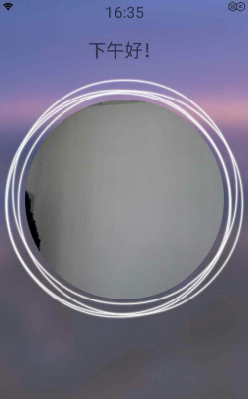
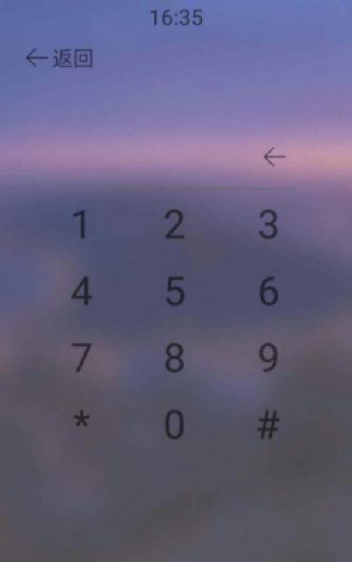
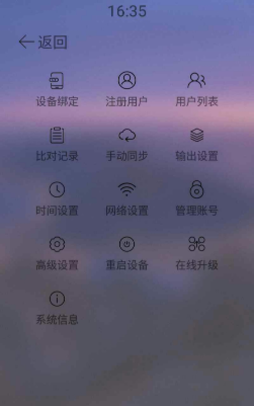
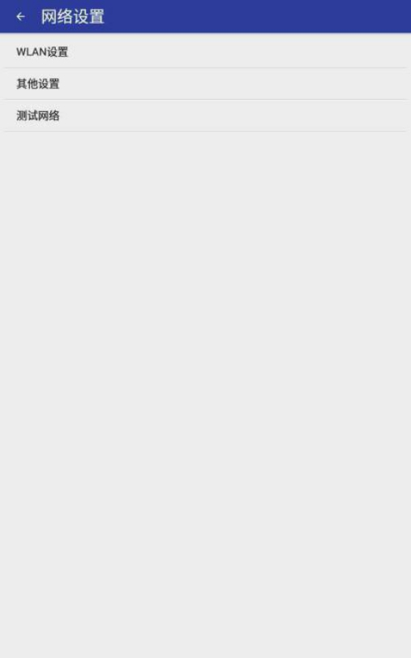
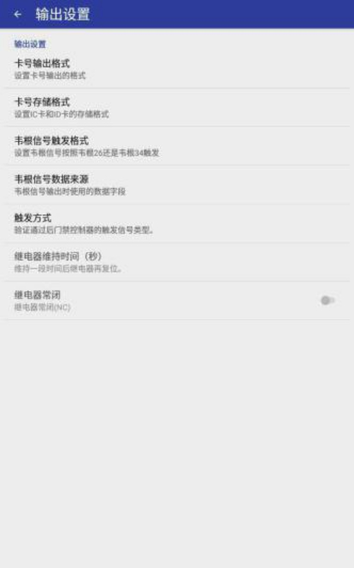
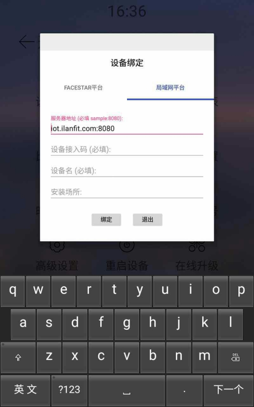
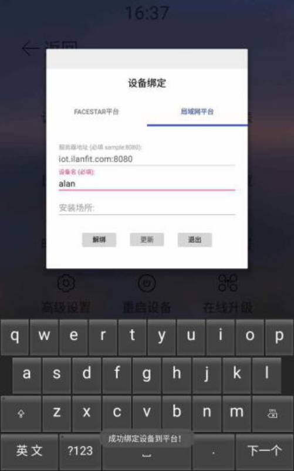
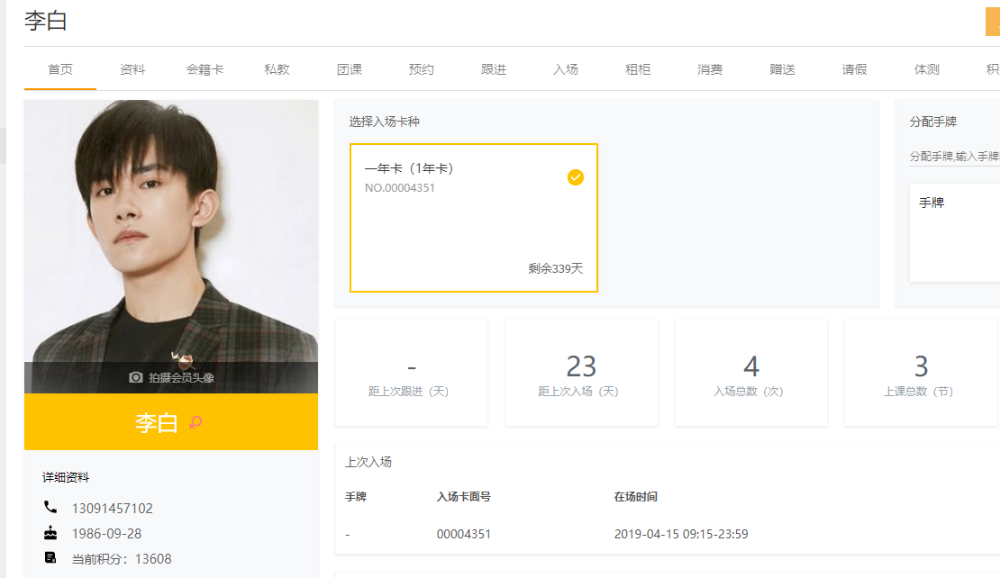
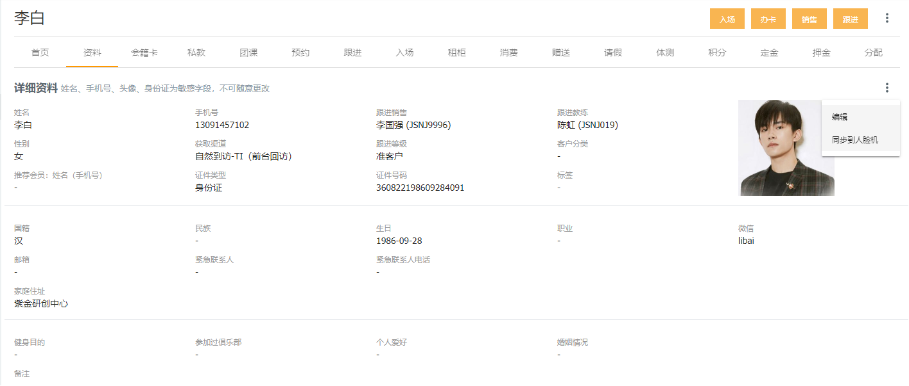

### 如何进入人脸识别机的设置界面

连续点击屏幕的右下角五下进入管理设置界面；

需要先输入管理密码，默认为12344321；

然后进入设置主界面，选择‘网络设置’。

### 首先为人脸机配置上网WIFI

进入‘WLAN’设置，并进行无线设置；

无线设置完毕退出到设置主界面；

### 输出设置

设置主界面选择‘输出设置’；

出现以下界面；

选择‘卡号输出格式’，选择‘10位10进制（4字节）’；

选择‘卡号存储格式’，选择‘10位10进制’；

选择‘韦根信号触发格式’，选择‘韦根34’；

选择‘韦根信号数据来源格式’，选择‘IC卡号’；

选择‘触发方式’，选择‘韦根信号’；

输出设置完毕退出到设置主界面。

### 设备绑定

设置主界面选择‘设备绑定’；

进入设备绑定，选择‘局域网平台’；

输入服务器地址：iot.ilanfit.com:8080；

输入设备接入码：（阿懒提供）；

输入设备名称：随意填写或不填；

输入完成后点击绑定；

绑定完成出现以下界面并点击退出；

退出到人脸设备主界面即可。

### 阿懒系统同步人脸机

阿懒系统进入会员主界面；

点击拍摄会员头像按钮进行拍摄上传即可；

点击会员资料；

点击头像右侧三点；

同步到人脸机；

操作已全部完成，即可使用。

**注：1.系统新上线的功能，可以实现在系统中用摄像头拍照，直接同步到人脸机，不需要在人脸机上操作录入人脸。** 

**2.系统需要配置一台像素较高的摄像头。**

 

