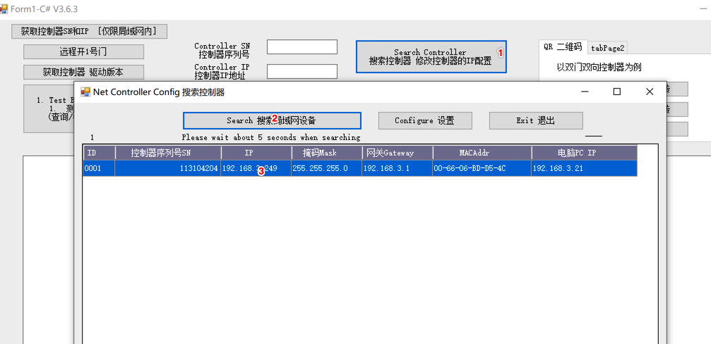

阿懒控制板是阿懒系统和智能设备连接的处理中心，需要保证控制板能够连接外网，并接入阿懒服务器。控制板最好专用一个网络，用网线直连宽带路由器，尽量不要和场馆的客户网络放在一起，防止客户大流量访问造成干扰。

1. 将控制板接入路由器或交换机，并确保能够连接互联网
2. 电脑需要跟控制板在同一个局域网中
3. 打开设置软件，点击 搜索控制器，图中  1 处
4. 在弹出窗口中点击搜索局域网设备，图中2 处 
5. 选择搜索到的控制板，点击设置，下图中4处。
6. 勾选修改接收服务器设置，填写IP   [116.62.119.250]()  端口 61005

