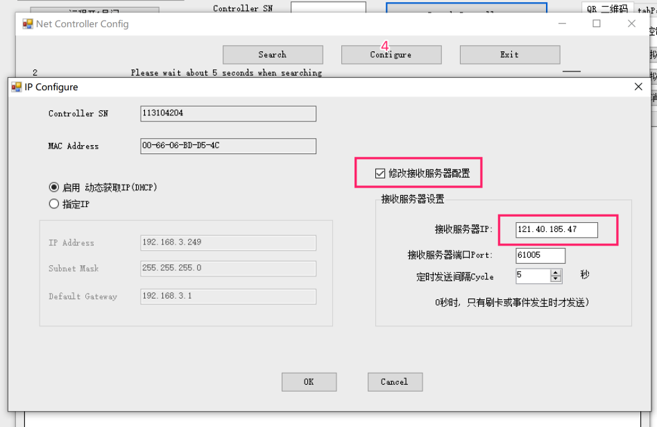

### 阿懒控制板是什么？

阿懒控制板是阿懒和国内著名厂商联合开发定制的一款与阿懒系统无缝集成的控制设备。
传统的门店已经有闸机、门禁锁，但这些设备是非智能的、不能联网的、无法进行系统权限管理的，如何让这些已经存在的非智能设备智能化？阿懒特地定制开发了这款控制板，可以无缝的将现有的非智能设备连接到阿懒系统，完成智能化改造。

### 阿懒控制板的好处是什么？

1. 将非智能设备转化成智能设备。
2. 充分使用俱乐部已经购买的设备，已有的闸机等都不用更换，减少浪费。
3. 改造简单，即插即用，只需要10分钟即可完成改造。
4. 成本非常低廉。

### 需要连接互联网吗？

是的，智能化的核心就是要联网。

### 注意事项

1. 需要保证控制板能够连接外网
2. 控制板最好专用一个网络
3. 用网线直连宽带路由器
4. 尽量不要和场馆的客户网络放在一起，防止客户大流量访问造成干扰。

### 阿懒控制板的连接方法

下图是双进双出控制板的连接示意图：

### 设置阿懒控制板（此工作一般已经由阿懒工作人员完成）

1. 将控制板接入路由器或交换机，并确保能够连接互联网
2. 电脑需要跟控制板在同一个局域网中
3. 打开设置软件，点击 搜索控制器，图中  1 处
4. 在弹出窗口中点击搜索局域网设备，图中2 处 
5. 选择搜索到的控制板，点击设置，下图中4处。
6. 勾选修改接收服务器设置，填写IP  **121.40.185.47**  端口 **61005**

