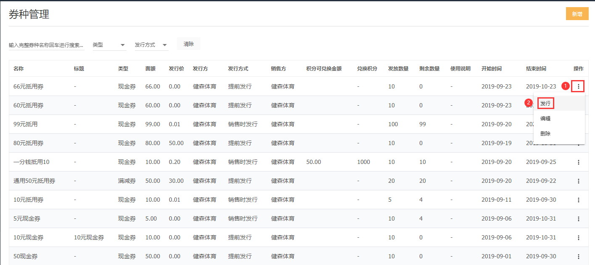
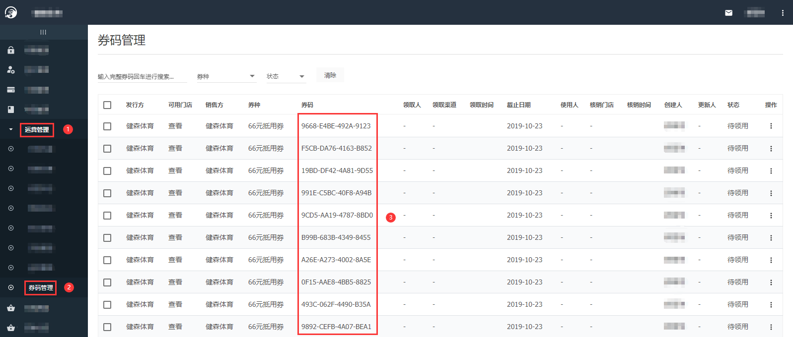
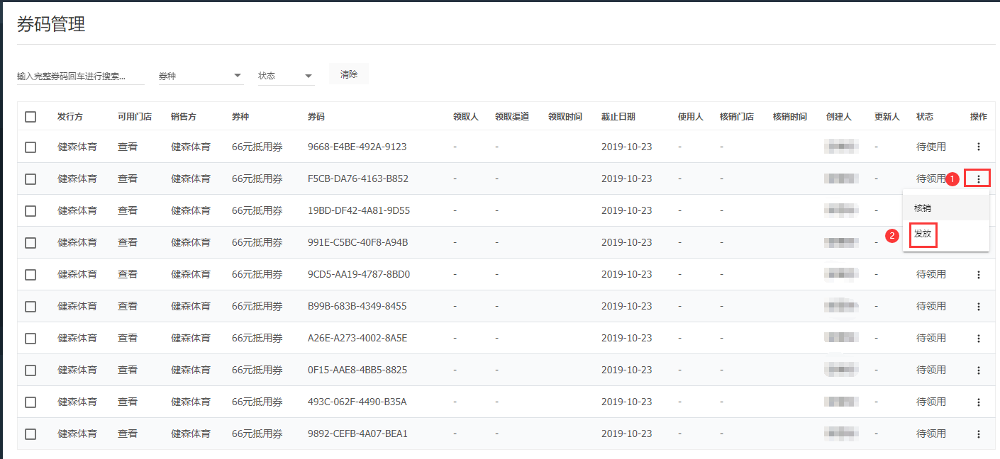
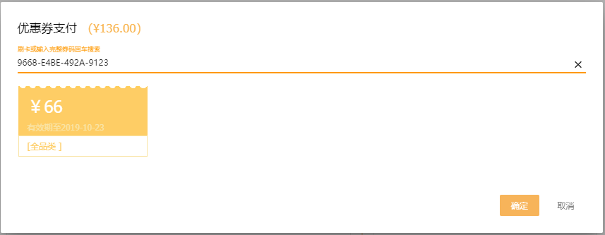
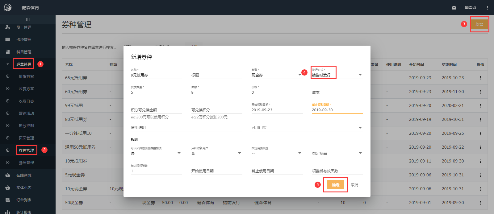
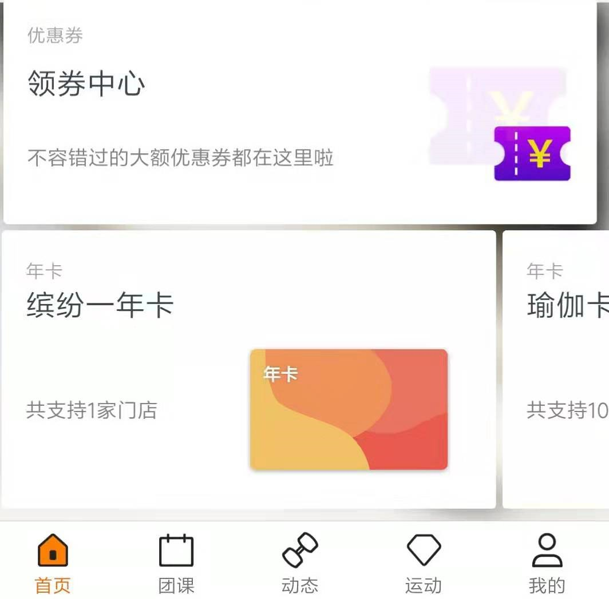

### 什么是阿懒优惠券？

优惠券是一种常用营销手段，使用优惠券可刺激用户消费欲，提升客流量。
现阿懒也推出此功能，办卡、买课等都可使用。
阿懒优惠券有两种发行方式：提前发行和销售时发行。
 - 提前发行，一般用于线下或第三方系统，在本系统配置优惠券后，券码将在系统中自动生成，
 可将券码通过各种方式提供给合作商户或自行印刷发放。也可以将券码放在大众点评等媒介上
 进行销售。是最常用和灵活的方式。
 
 - 销售时发行用于阿懒会员在线领取，是指会员可通过阿懒会员小程序领取此优惠券，领取后券码将自动生成，到门店即可使用。

### 提前发行优惠券配置方法：

配置券种：总部系统-运营管理-券种管理-新增

发行券种：总部系统-运营管理-券种管理-抵用券后三个点-发行

查看券码：总部系统-运营管理-券码管理

发放券码：总部系统-运营管理-券码管理-券码后三个点-发放

使用券码：办卡/买课/购买商品-付款-付款方式选择优惠券（先选择优惠券抵扣，再选择其他方式补付余款）-输入券码-确定

### 销售时发行优惠券配置方法：

配置券种：总部系统-运营管理-券种管理-新增

领取优惠券：阿懒会员-首页-领券中心-找到抵用券-领取

查看券码：阿懒会员-我的-我的票券-点击票券-自动生成券码

使用券码：同提前发行优惠券方式

### 

