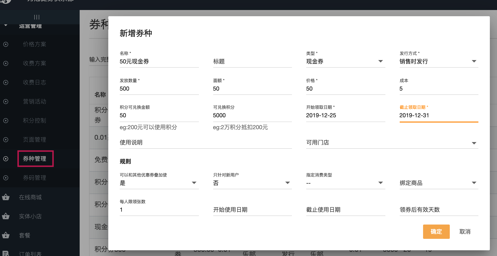
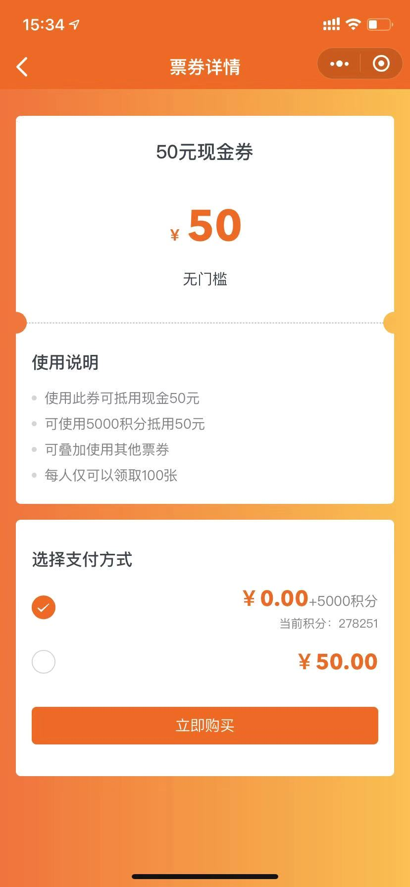
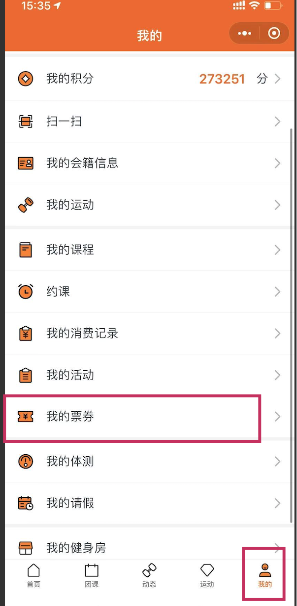

### 什么是阿懒优惠券？

优惠券是一种常用营销手段，使用优惠券可刺激用户消费欲，提升客流量。
现阿懒也推出此功能，办卡、买课等都可使用。
阿懒优惠券有两种发行方式：提前发行和销售时发行。
 - 提前发行，一般用于线下或第三方系统，在本系统配置优惠券后，券码将在系统中自动生成，
 可将券码通过各种方式提供给合作商户或自行印刷发放。也可以将券码放在大众点评等媒介上
 进行销售。是最常用和灵活的方式。
 
 - 销售时发行用于阿懒会员在线领取，是指会员可通过阿懒会员小程序领取此优惠券，领取后券码将自动生成，到门店即可使用。

### 提前发行优惠券配置方法：

配置券种：总部系统-运营管理-券种管理-新增

发行券种：总部系统-运营管理-券种管理-抵用券后三个点-发行

查看券码：总部系统-运营管理-券码管理

发放券码：总部系统-运营管理-券码管理-券码后三个点-发放

使用券码：办卡/买课/购买商品-付款-付款方式选择优惠券（先选择优惠券抵扣，再选择其他方式补付余款）-输入券码-确定

### 销售时发行优惠券配置方法：

配置券种：总部系统-运营管理-券种管理-新增

领取优惠券：阿懒会员-首页-领券中心-找到抵用券-领取

查看券码：阿懒会员-我的-我的票券-点击票券-自动生成券码

使用券码：同提前发行优惠券方式

### 用积分兑换券的配置

#### 配置券种

重要填写项解释：
- 发行方式 选择销售时发行，表示让会员在阿懒会员小程序上自行兑换优惠券
- 面额 此券的面额，支付时候可以抵扣的钱
- 价格 售卖价格，0元就是免费券
- 成本 此券的真实成本，可以不填
- 积分可兑换金额，
  - 例1 假设券价格50元，积分可兑换金额30元，表示券卖50元，其中30元可以用积分兑换，剩余20元必须人民币支付
  - 例2 假设券价格50元，积分可兑换金额50元，表示券卖50元，全部可以用积分来支付
- 可兑换积分 表示需要多少积分
  - 比如上面的例1，30元需要 30000积分，那么这里填写30000即可。会员购买此券需要支付30000积分+20元人民币
  - 比如上面的例2，50元需要50000积分，那么这里填写50000即可。会员购买此券仅需支付50000积分，不需要支付人民币
  
#### 小程序兑换优惠券
- 进入小程序领券中心

- 积分抵扣券

- 我的票券
会员进入我的票券可以查看券码，用于支付购买商品等
系统中使用券支付，参考本文上方 使用券码 段落

