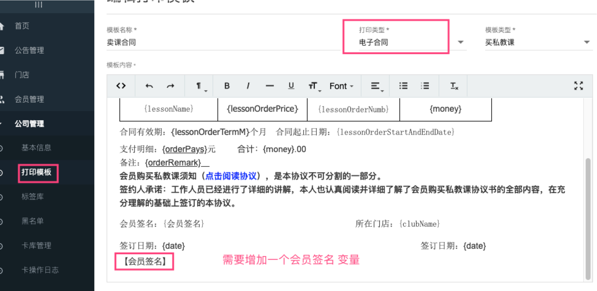
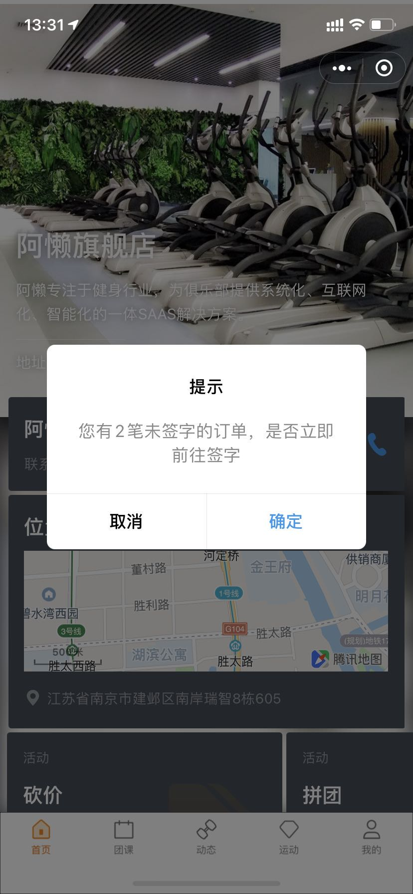
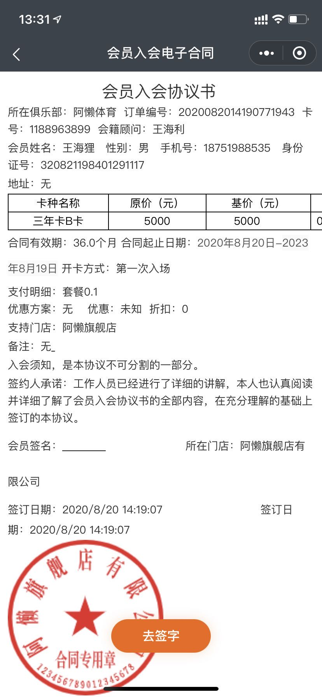
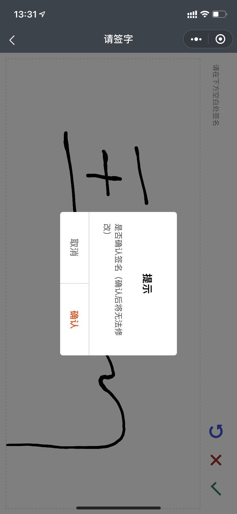
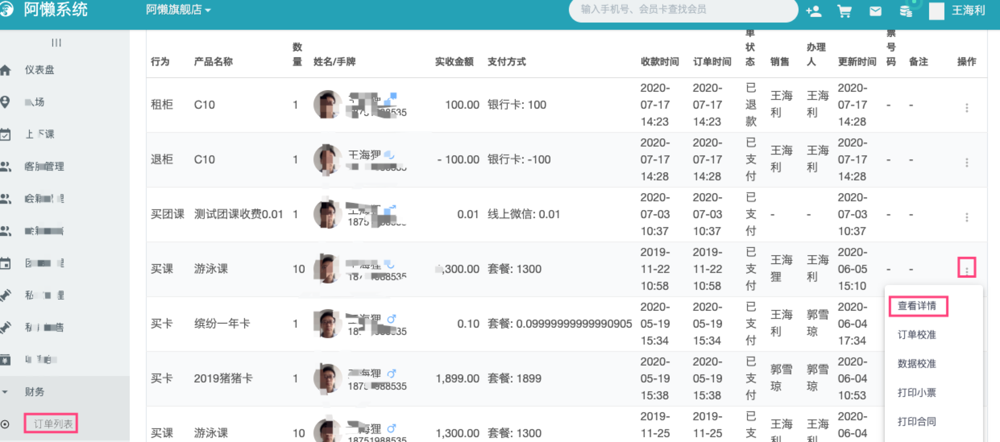
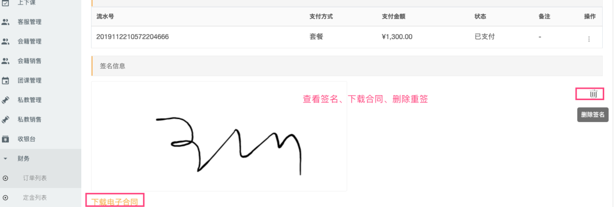
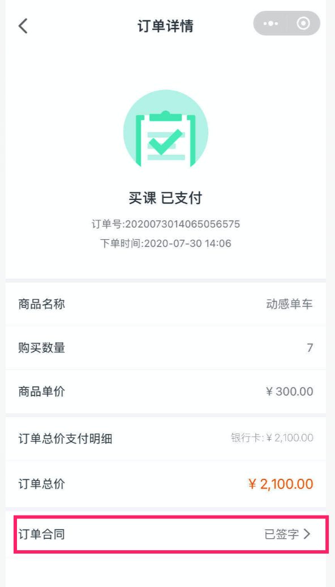

### 第一步，配置电子合同

#### 总部添加电子合同模板

在总部系统 “公司管理-打印模板”菜单中添加一个打印类型为“电子合同”的模板，模板内容可以采用普通合同的内容，但是需要增加一个会签名的变量，如下图

### 第二步 会员打开阿懒会员
若有未签字订单，将自动弹出，也可以进入 我的--我的消费，找到对应订单，点击订单合同

点击确定

点击去签字

### 第三步 下载合同、查看签名、删除签字重签

### 在门店系统中查看

在 在财务--订单列表中找到对应的订单，点击订单详情后进入订单详情页面查看。并可以下载电子合同，删除签名让会员重新签署。

### 会员在阿懒会员小程序中查看下载合同或重新签字

进入 我的--我的消费，找到对应订单，点击订单合同即可，
在这里也可以重新签字（需要后台删除之前签名）

