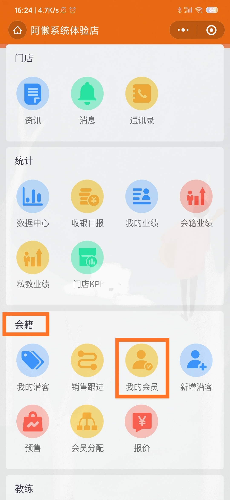
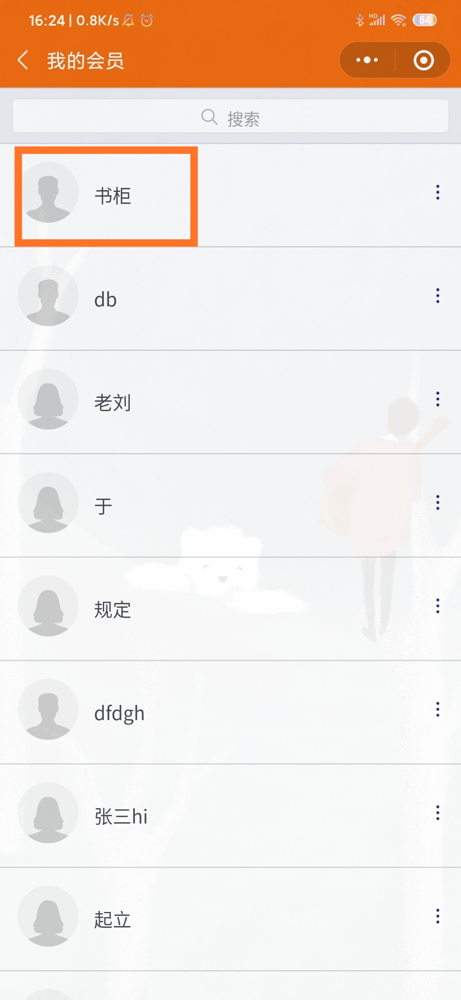
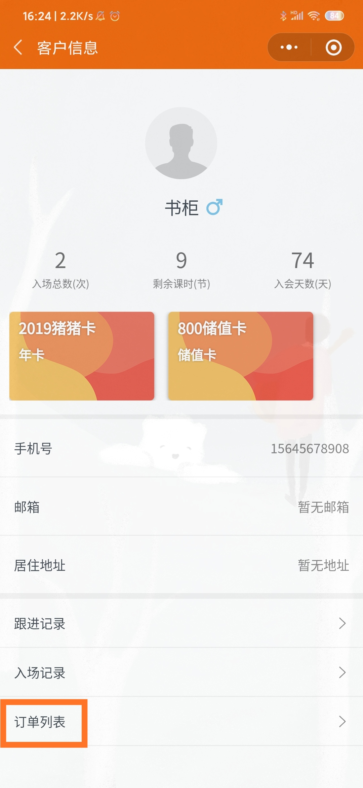
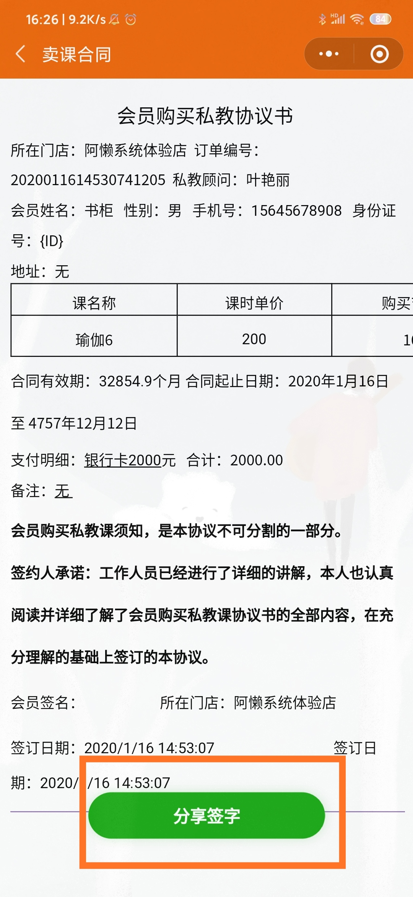
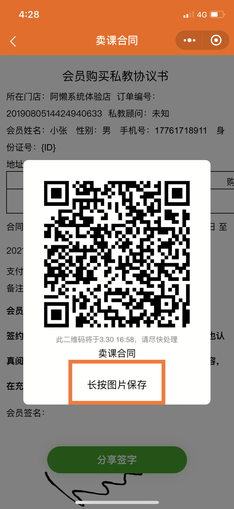
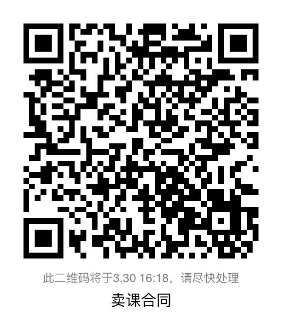
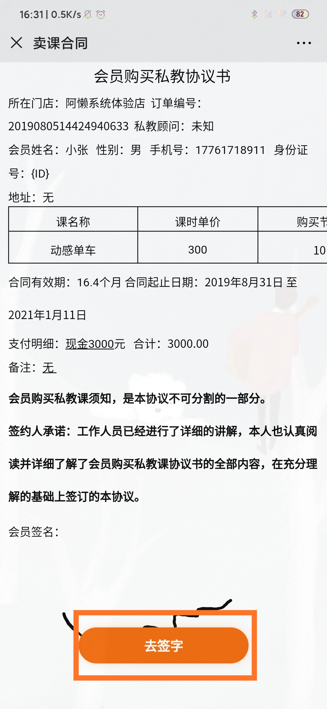
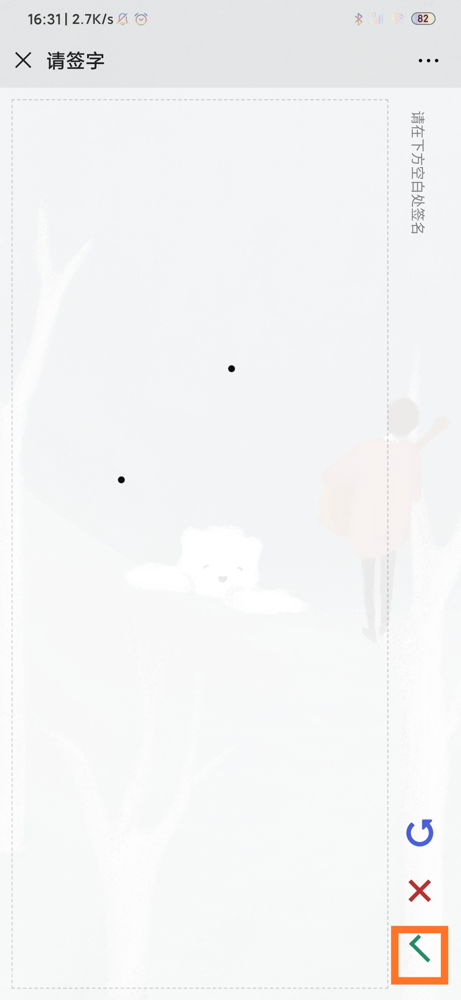

### 第一步：会籍把购买合同二维码分享给会员

- #### 【微信搜索阿懒会籍-会籍-我的会员】

- #### 【点击会员姓名】

- #### 【点击订单列表】

- #### 【点击某一订单后三个点-查看合同】

- #### 【点击分享签字】

- #### 【点击长按图片保存-发送给会员】

### 第二步：会员扫描二维码，确认签字

- #### 【会员使用微信扫描会籍给的二维码】

- #### 【点击去签字】

- #### 【签好字-点击确认按钮】

