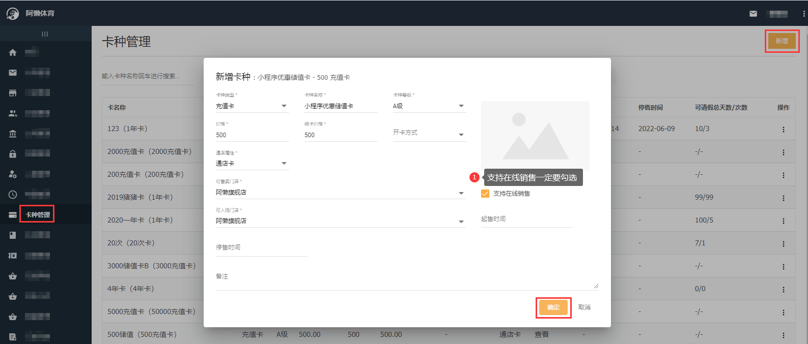
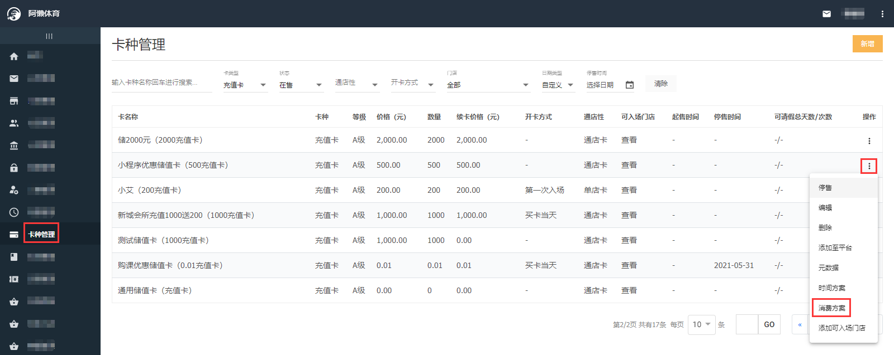
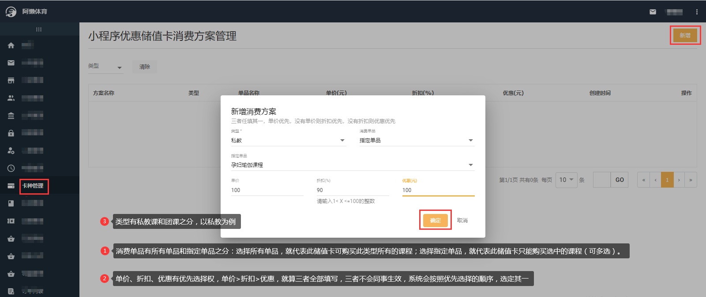
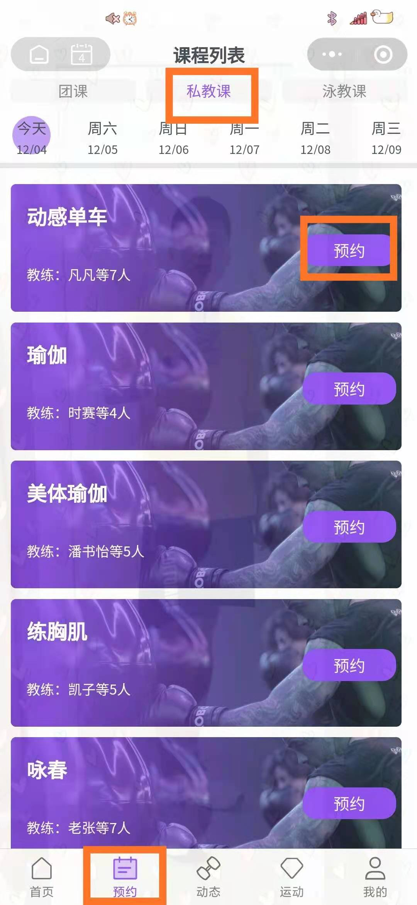
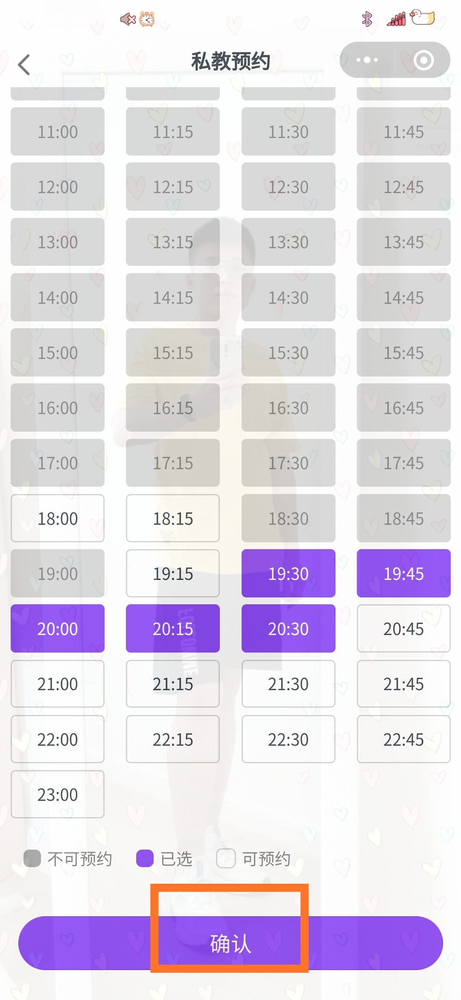
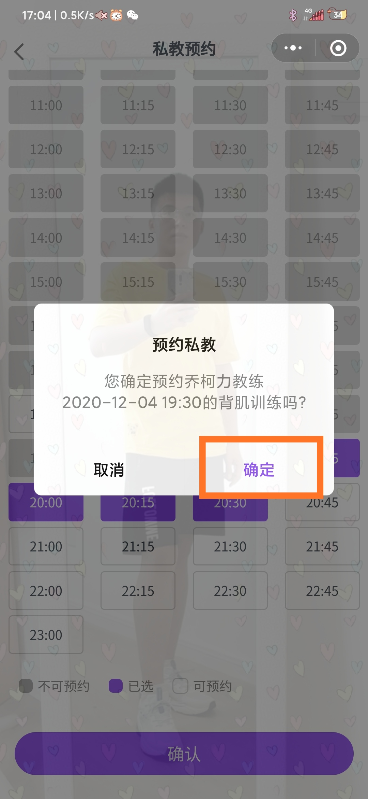
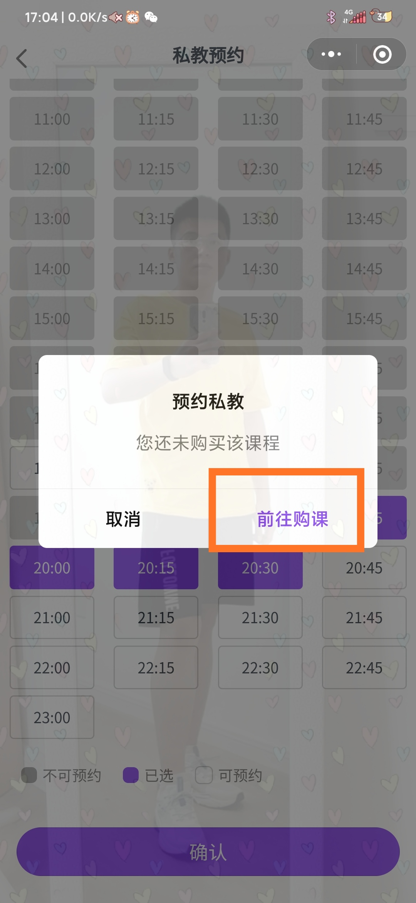
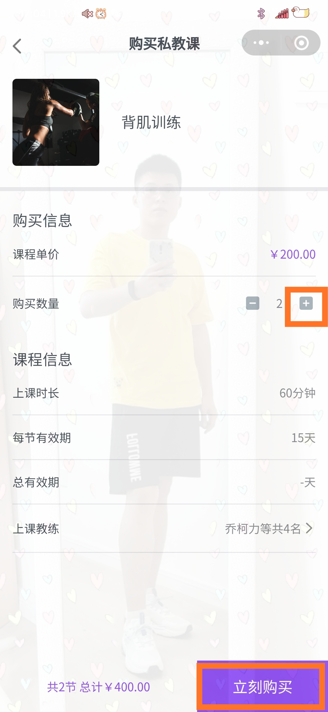
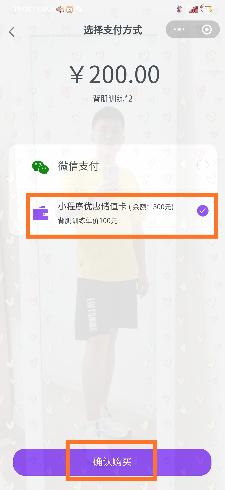

### 储值卡线上购买课程是指什么？

会员购买了特定储值卡（储值卡需要在总部系统中配置消费方案）后，可以在阿懒会员小程序中用此储值卡自行购买团课或私教课。

### 门店怎么配置才能实现储值卡线上购买课程？

- 先配置储值卡：【总部系统-卡种管理-新增】，如图所示

  

- 针对此储值卡配置消费方案：【总部系统-卡种管理-储值卡后三个点-消费方案-右上角新增】

- 门店系统帮会员购买储值卡或会员在阿懒会员小程序自行购买储值卡
- 储值卡购买后，会员登陆阿懒小程序自行购买课程：【阿懒会员-预约-团课/私教课-预约-选择教练、时间、座位-确认-确定-前往购课-添加购买数量-立即购买-选择储值卡-确认购买】

### 如果购买课程的价格超过储值卡的价格还可以用储值卡吗？

不可以，支付页面还是可以看到储值卡的，选择储值卡购买会提示储值卡余额不足。

### 为什么使用微信支付价格和储值卡价格不同？

可能储值卡配置消费方案的时候单价设置的比私教课的原本单价低，或选择了折扣和优惠，微信支付的价格=原本私教课的价格*数量，不含任何优惠。

