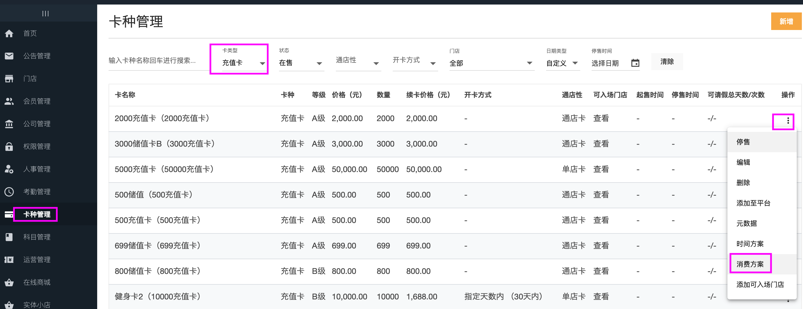
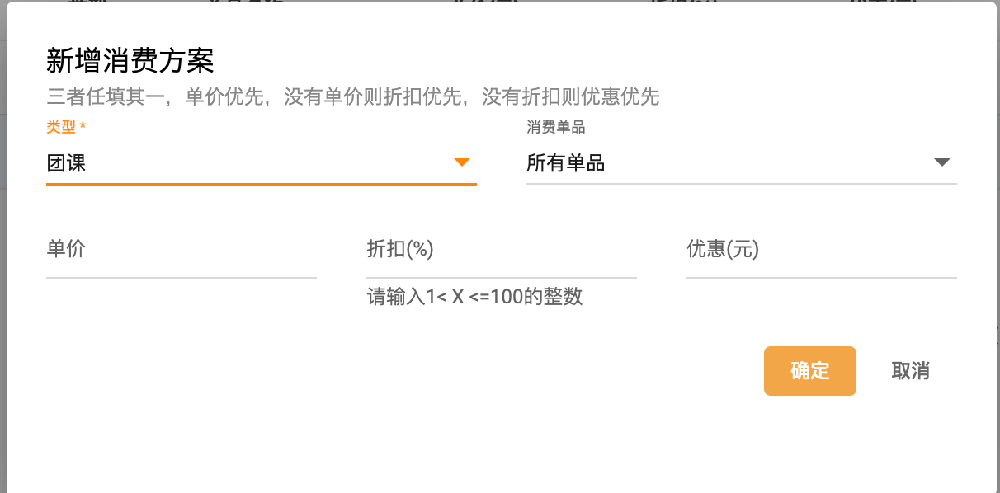

### 如何让储值卡支持入场扣费、单次团课预约扣费？
以单次预约团课为例

#### 总部卡种设置消费方案

#### 给会员购买设置了方案的储值卡

#### 设置收费团课并排课
参考：
  [收费团课](../团课/收费团课.md)
  [团课排课](../团课/团课排课.md)
  [新增团课](../团课/新增团课.md)
  
#### 小程序端会员自助约课扣费
在小程序端预约收费团课，如果会员已经购买了设置的储值卡，
则可以选择扣费预约

#### 在 门店--上下课 中操作团课上下课后正式扣费

