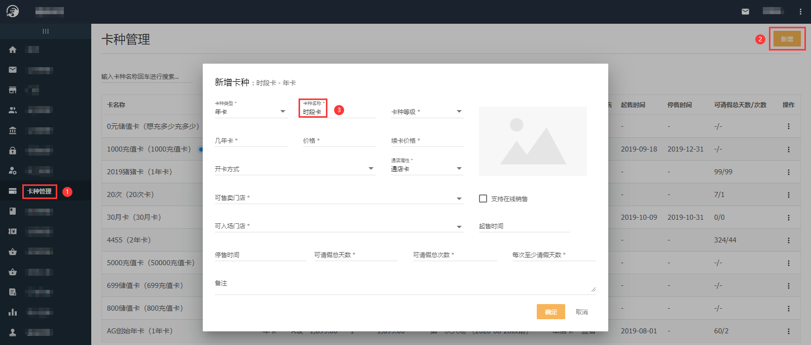
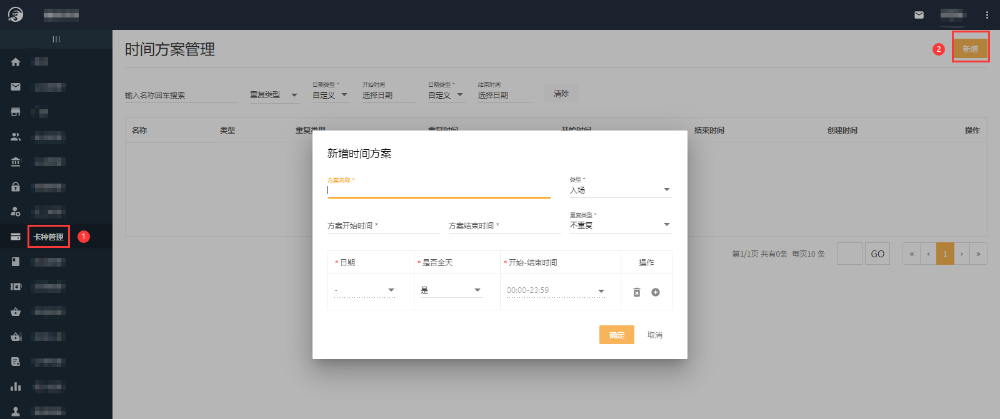
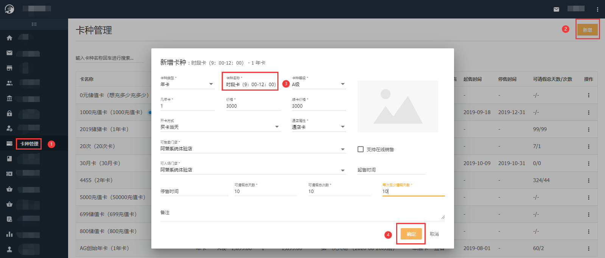
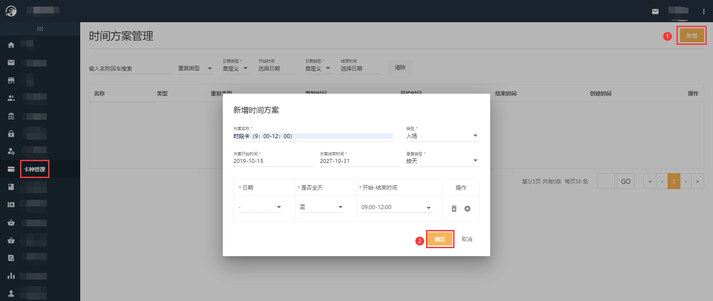

### 什么是时段卡？

时段卡就是限制会员入场时间段的卡种。

### 怎么配置时段卡？

- 首先配置时段卡的卡种：【总部系统-卡种管理-新增】，详情见《[新增卡种](https://alanfit.github.io/AlanHelpDoc/阿懒俱乐部版本/卡种/新增卡种)》

- 其次配置时间段：【总部系统-卡种管理-卡种后三个点-时间方案-右上角新增】

- 最后就可以帮会员购买次卡了：【门店系统-会员详情页面-办卡】，详见《[购买会籍卡](https://alanfit.github.io/AlanHelpDoc/阿懒俱乐部版本/会员操作/购买会籍卡)》。

### 例：如想要配置只可以在每天上午9：00-12：00可以入场的时段卡，该如何配置？

- 配置卡种：【总部系统-卡种管理-新增】

注：卡种类型、卡种等级、几年卡、价格、续卡价格、开卡方式、通店属性、可售卖门店、可入场门店、起停售时间、可请假总天数、可请假总次数、每次至少请假天数根据门店自己需要填写，此图只是个例案。

- 为时段卡配置时间段：【总部系统-卡种管理-时段卡（9：00-12：00）卡种后三个点-时间方案-右上角新增】

注：方案名称可同卡种名称；类型选择入场；方案开始结束时间是针对此方案的，代表此方案执行的有效期，如果不限制结束时间选择2090年这样无限大的年份即可；重复类型有不重复、按天、按周、按月四种，选择不重复或按天效果是一样的，然后是否全天选择否（日期不可选），开始-结束时间选择一下，就代表全年每天9：00-12：00这一时间段才可以入场；如果选择按周并选择周一和时间9：00-12：00，就代表每年中每周一的9：00-12：00才可以入场，点击最右方的加号可以增加入场周期；如果按月并选择每月一号和时间9：00-12：00，就代表每年中只有每月一号9：00-12：00才可以操作入场。点击右面的加号也可增加每月入场天数。

- 帮会员买卡：【门店系统-会员详情页面-办卡】

### 如果帮会员购买了时段卡（9：00-12：00），那不在这个时间范围内还可以进行入场操作吗？

不可以，因为次卡种配置了时间方案，不在此时间段内进行入场操作，系统可以自动识别出并显示：次卡不在入场时间段。

### 如果想要修改或删除时间方案该怎么办？

【总部系统-卡种管理-时段卡卡种后三个点-时间方案-选择时间方案点击后面三个点-编辑/删除】

