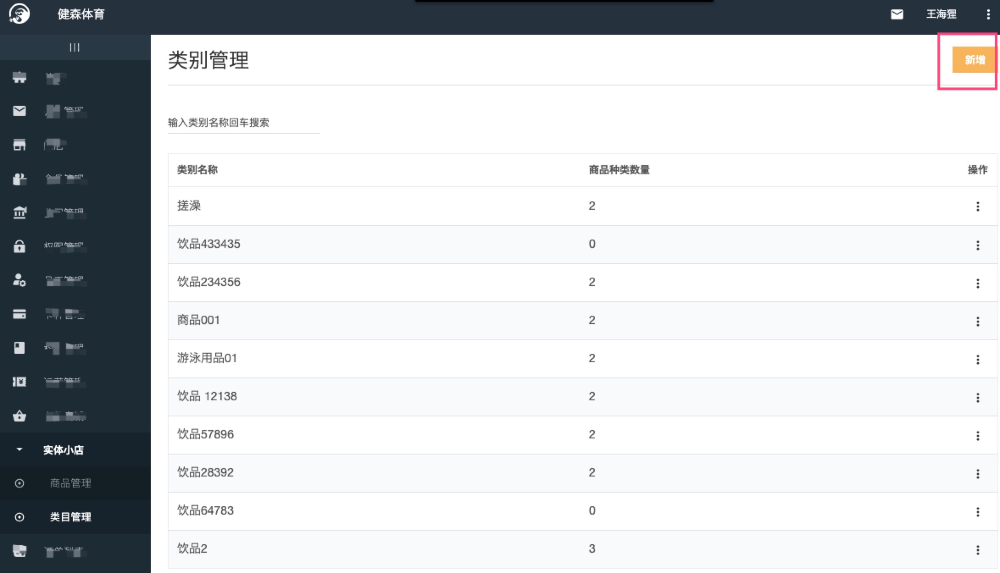
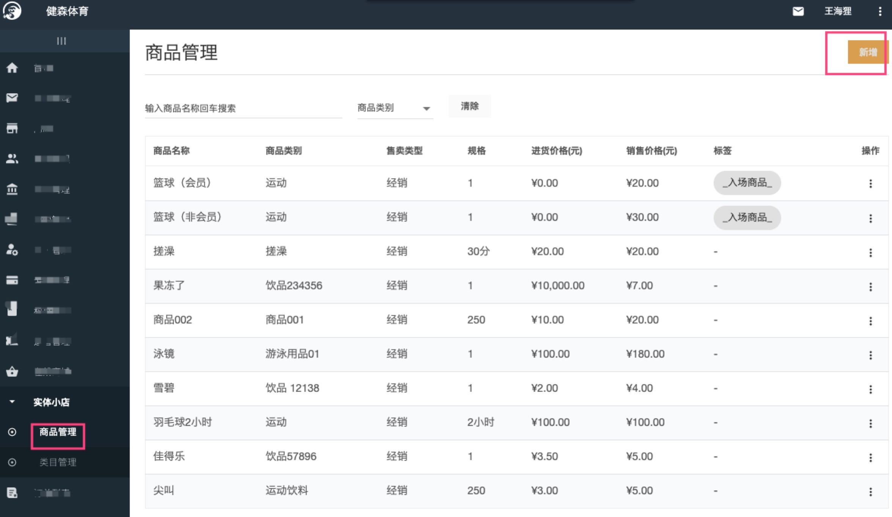
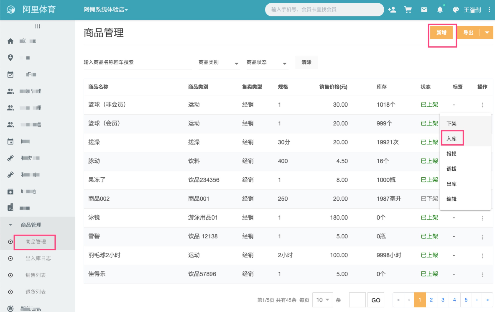
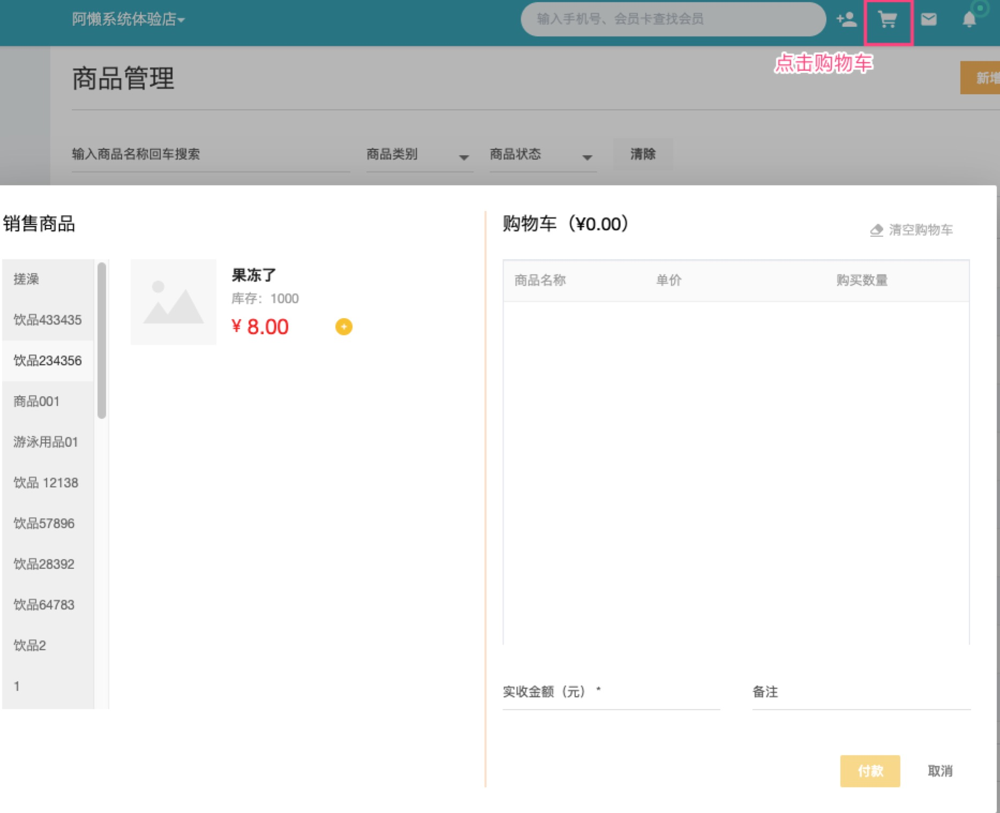

###  阿懒商品管理
阿懒系统商品模块，根据职责分工，跟私教课类似。
  - 总部负责商品分类、商品名称、价格、规格等信息的录入
，做到统一管控
  - 门店负责进货、入库存、售卖等
### 总部商品录入
进入[总部系统 https://console.alan.fit](https://console.alan.fit)

实体小店 菜单

首先进行商品类目的设置：

设置完成后，进行具体的商品录入

### 门店商品管理
进入[门店系统 https://desk.alan.fit](https://desk.alan.fit)
商品管理菜单
  - 新增商品，选择商品（总部建立的商品），基本信息自动填入，
只需设置售价、库存

  - 已有商品新增库存，使用入库操作
  

### 商品销售

售卖分为匿名售卖和实名售卖

  - 匿名售卖不关注谁买了商品。

    -  点击阿懒系统标题栏右侧的购物车图标(水吧销售)
    - 选择左侧的商品分类，筛选出想要出售的商品
    - 点击商品的增加图标，将商品加入购物车
    - 进行付款操作

  - 如果进行实名售卖，请进入会员详情，选择右上角销售菜单进行销售

