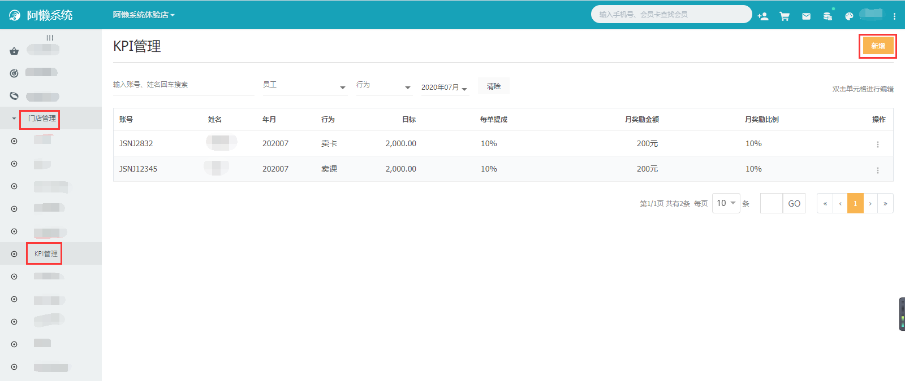
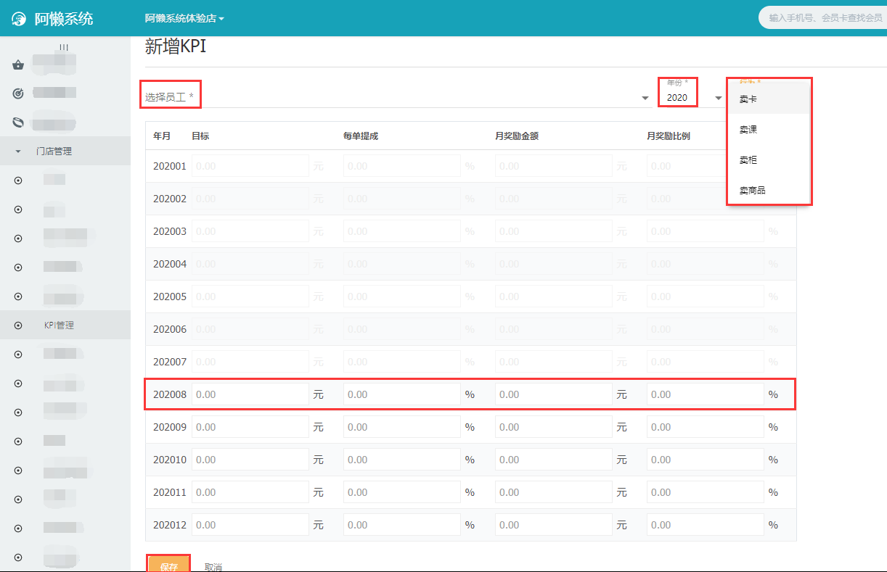
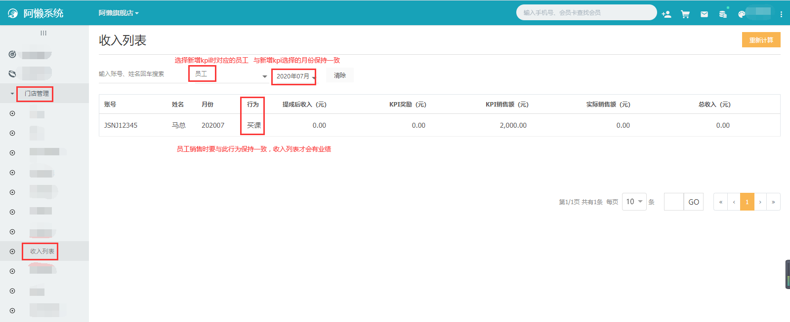
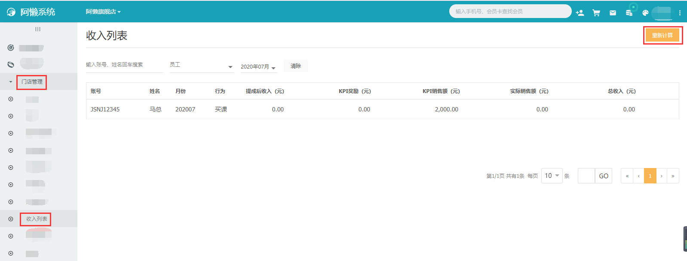

### 什么是kpi考核？

kpi考核，指的是关键绩效指标考核法。有利于激发员工的工作积极性，从而提升企业的整体绩效。

### 如何配置kpi？

- 首先需要新增KPI（根据门店规则配置员工的行为、目标成交额、每单给的提成比例、月奖励金额和月奖励比例）：【门店系统-门店管理-KPI管理-右上角新增】

- kpi配置好了之后，就可以帮会员买卡/买课/买柜/买商品（销售的行为需要与新增kpi时的行为保持一致，收入列表里才会有收入；销售也要选择对应的员工，如果没有选择对应销售将没有绩效），然后在收入列表选择对应的员工和月份，系统会自动计算出员工的收入：【门店系统-门店管理-收入列表】   

### 为什么收入列表的数据与员工成单的收入不一致？  

数据不一致可能是因为员工成了单，但系统没有实时更新，收入列表有重新计算功能，点击一下就会重新核算工资收入，更新数据：【门店系统-门店管理-收入列表-右上角重新计算】

