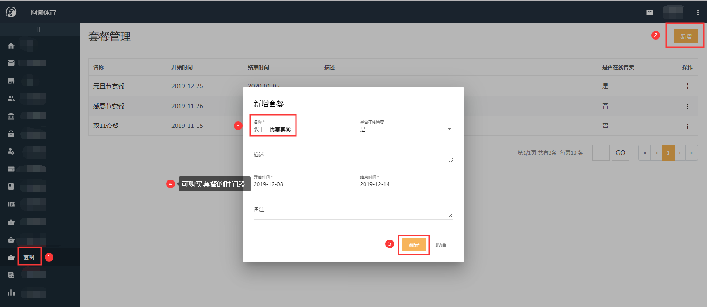

### 什么是套餐？

套餐是阿懒系统新推出的营销策略，总部可以配置包含卡、课、商品、优惠券的套餐进行统一售卖，价格上可以做出些许的优惠，从而刺激会员的消费。

### 怎么配置套餐？

以双十二套餐为例：

- 先配置套餐中包含的卡种、课程、商品、优惠卷(此四类可随意组合,如果套餐中不包含商品,配置套餐的时候可不做选择)。配置方法详见：《[新增卡种](https://alanfit.github.io/AlanHelpDoc/阿懒俱乐部版本/卡种/新增卡种)》《[设置私教课](https://alanfit.github.io/AlanHelpDoc/阿懒俱乐部版本/私教课/设置私教课)》《[商品管理](https://alanfit.github.io/AlanHelpDoc/阿懒俱乐部版本/商品管理/商品管理)》《[优惠券管理](https://alanfit.github.io/AlanHelpDoc/阿懒俱乐部版本/优惠券/优惠券管理)》；
- 配置套餐：【总部系统-套餐-新增】

- 新增套餐商品：【总部系统-套餐-点击套餐的名称-新增套餐项】

- 套餐配置好之后就可以在阿懒会籍上查询到并分享给会员了：【阿懒会籍-报价-公司套餐-套餐后三个点-分享-保存二维码（发给会员）】

  

  

- 会员收到销售发的二维码，使用微信识别二维码跳转到阿懒微信小程序去付款

  

### 总部配置的套餐项会员不是很满意，教练或会籍可以根据会员想要的套餐项进行配置套餐吗？

可以的，教练或会籍可以通过阿懒会籍自己配置（教练或会籍配置的叫报价，总部配置的叫套餐），但需要经理审核通过之后才可以分享给会员。

教练或会籍配置报价方法：

- 配置报价：【阿懒会籍-报价-我的报价-新增报价（输入名称、开始时间）-确认（跳转到新增报价项页面）-点击页面下方加号-选择分类-确认添加（可继续点击加号新增报价项）】

  

  

  

- 告知经理，报价已配置好，请求经理审核，经理审核方法：【阿懒会籍-报价审核-点击报价-审核通过】（未审核的报价前没有绿色通过按钮，审核通过的报价前会有绿色按钮标志通过）

- 经理审核通过后，即可把报价分享给会员：【阿懒会籍-报价-我的报价-点击报价后三个点-分享】（经理审核通过的报价前会有绿色按钮标志通过，即可分享，如没有绿色标注则不可分享）

### 会员购买了套餐并成功付款后，如何使用？门店如何操作？

门店需操作执行按钮，执行即购买：【门店系统-客服管理-套餐管理-点击会员购买的套餐名称-点击套餐商品后面三个点-执行-输入商品相关信息-确认-确认-状态为已执行就可以了】

#### 为什么有的套餐可以分享？有的套餐不可以分享？

只有经理审核通过的套餐才可以分享，审核通过的报价前会有绿色按钮标志通过，经理审核方法：【阿懒会籍-报价审核-点击报价-审核通过】

