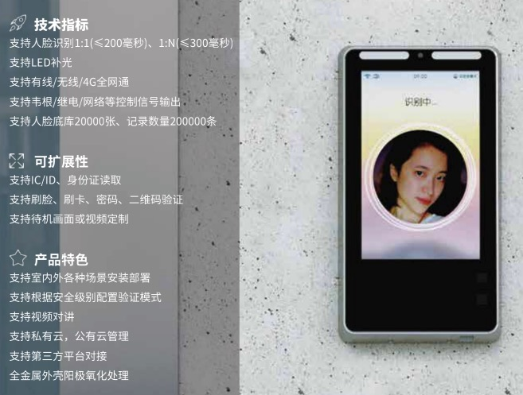
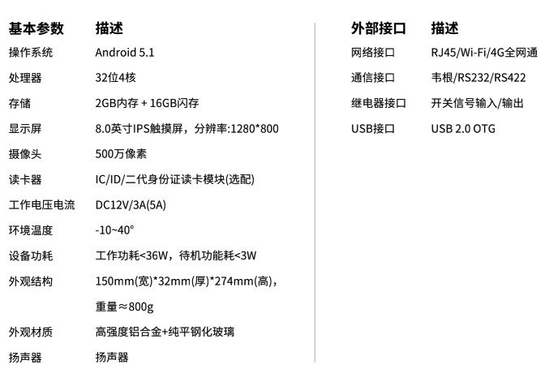

### 阿懒人脸识别设备特点
  - 金属外壳阳极氧化处理，高端大气
  - 8寸大屏幕
  - 支持有线、无线、4G全网通
  - 支持LED补光
  - 支持韦根、继电、网络等控制信号输出，支持所有门禁、闸机
  - 支持IC、ID卡读取、身份证读取
  
  
  
  
  
### 阿懒人脸识别功能特点
  - 前台录入一键同步，只需前台配置一个电脑摄像头，
    拍照后系统可一键同步人脸到门店的多台设备中（包括私教消课人脸机），
    无需多次录入
  - 云端永久保存高达2万张人脸，毫秒级识别速度，设备损坏、更换
    人脸数据不会丢失，做到数据安全万无一失
  - 会员卡到期自动取消入场权限，续卡后自动增加入场权限，无需额外操作
  - 活体检测，防作弊
  - 支持各种门禁，实现扫脸开门，具体请查阅 [人脸门禁](./人脸门禁)
  - 支持各种闸机，实现扫码开闸，具体请查阅 [闸机](./闸机.md)
  - 实现私教刷脸自动消课，具体查阅 [私教销课人脸机](./私教消课人脸机.md)
  - 可以安装在前台实现刷脸入场，具体查阅[入场人脸识别机](./入场人脸识别机.md)
### 支持各种场景，系统中轻松配置
  - 进门刷脸，系统中会员自动入场
  - 防止多次入场，系统可设置是否允许多次刷脸入场
  - 出门刷脸，系统中会员自动离场
  - 场地区分，如私教区、团操区、瑜伽室仅限预约会员刷脸进入
  - 卡种区分，如持有游泳卡会员可以刷脸进入泳池区域，
    其他非游泳会员无法刷脸进入
  
  
    