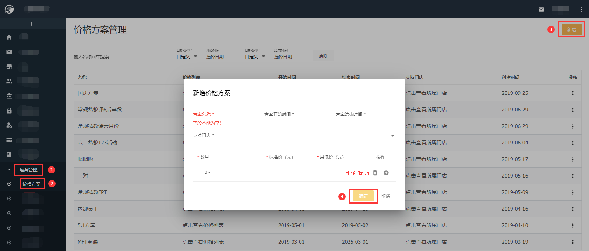
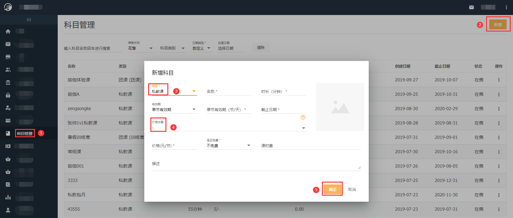
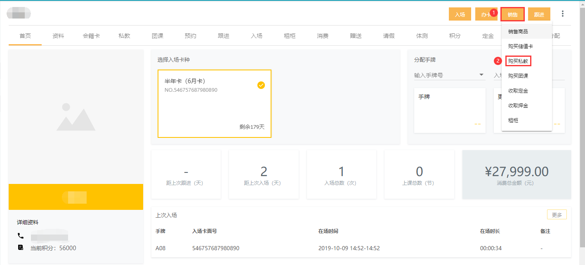

### 什么是私教课价格方案？

私教课价格方案是本系统的一项功能，用于门店针对某一私教课阶梯式收款，例购买0~10节单价200元，购买11~20节单价190元；这种实现方式就需要使用本系统价格方案功能来配置。

### 如何使用价格方案？

- 首先需要配置价格方案：【总部系统-运营管理-价格方案-新增】

- 其次需要新增课程绑定价格方案：【总部系统-科目管理-新增私教课-选择价格方案】

注：如果私教课程已存在，需要绑定价格方案：【科目管理-课程后三个点-编辑-增加价格方案-确定】

- 最后就可以帮会员正常购买私教课了：【门店系统-会员个人详情页-销售-购买私教】

  

### 如果私教课不想使用价格方案了怎么办？  

【总部系统-科目管理-课程后三个点-编辑-去掉价格方案-输入课程的单价-确定】

