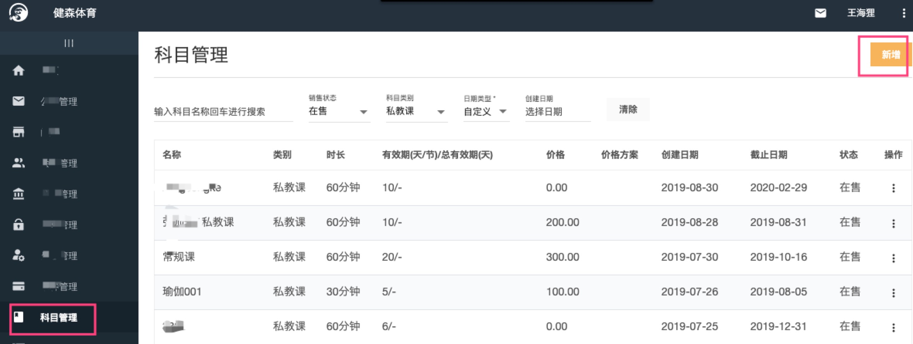
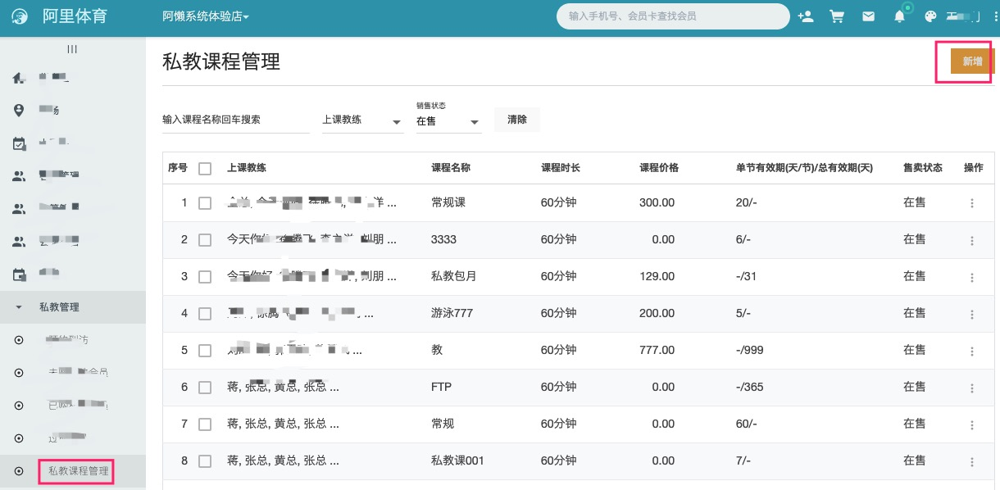
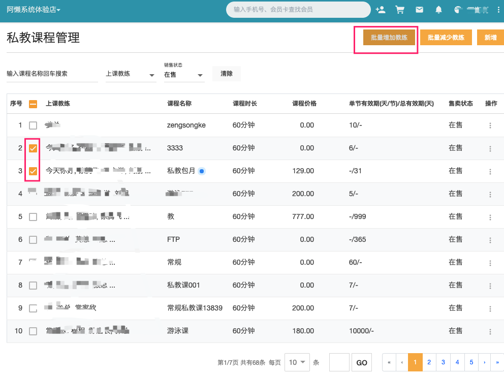

### 科目和课程
关于私教课，阿懒系统有科目和课程两个概念
  - 科目由总部系统统一管理控制，如价格方案、名称等
  - 课程由门店进行添加，主要是设置上课教练，每个门店的教练是不一样的
  
科目类似教育部规定的语文、数学等科目，
门店的课程类似A小学开设语文课程，上课老师是张老师；
B小学也开设语文这个课程，上课老师是刘老师

因此开设一门私教课，需要两步：

  - 第一步总部新增一个科目
  - 第二步门店新增私教课程，设置上课教练
  
### 新增科目

进入 [总部系统 https://console.alan.fit](https://console.alan.fit)

#### 填写字段说明
  - 有效期 分为单节有效期、总有效期。
  
    比如 单节有效期填写7，指一节课有效期7天
  如果买了10节，那就是70天有效期；
  
    总有效期 100天，是指课程不管买多少节，都是固定的有效期100天
     
  - 是否免费
    如果选择了免费课程，那么这个课程是专门用来赠送的。门店如果需要赠送课程，
    总部就需要配置一个免费课程，如 免费常规课、免费MFT 等

### 新增私教课：
进入 [门店系统 https://desk.alan.fit](https://desk.alan.fit)

### 编辑私教课
对已有私教课进行编辑，比如添加上课教练等，在上图 操作 三个点，点击编辑即可

### 新入职了一个教练，如何添加到上课教练

- 门店-员工中录入教练信息，设置角色为教练
- 单个课程添加上课教练：私教管理-私教课程管理中编辑课程，添加上课教练
- 多个课程批量添加上课教练：私教管理-私教课程管理，勾选需要添加的课程
点击右上角 批量添加
