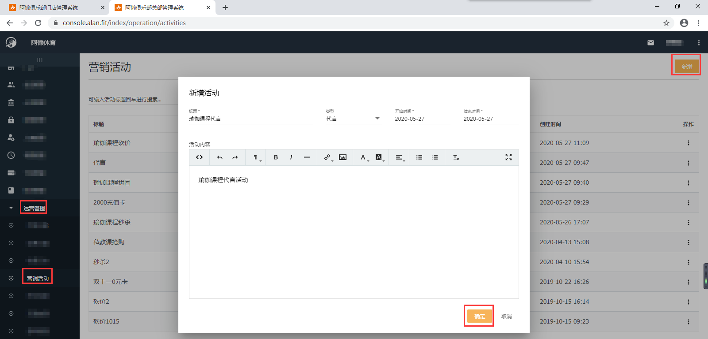
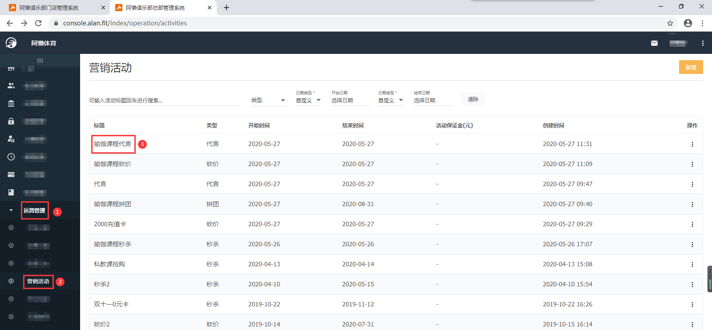
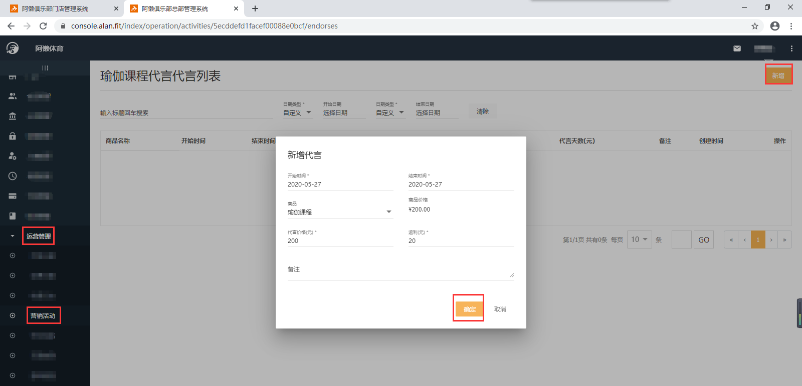
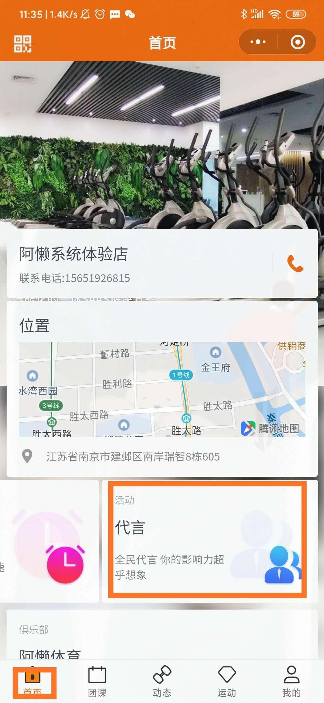
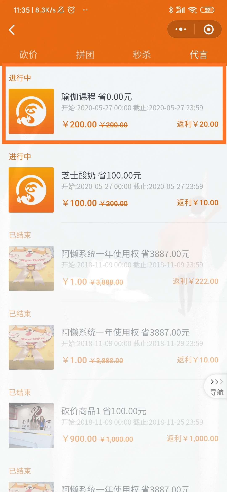
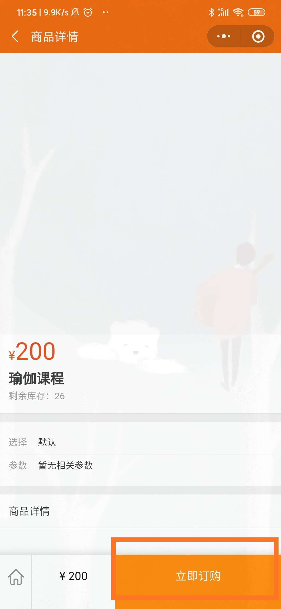
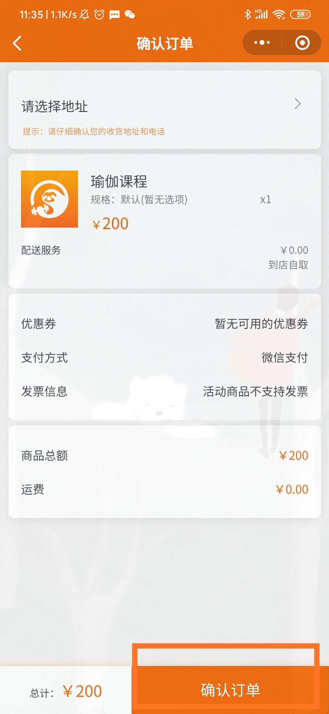

### 什么是代言活动？

会员通过阿懒会员购买商品成功后，会生成一个二维码，把二维码分享给其他客户，客户通过此二维码购买并消费成功后，会给会员返现。

### 怎么配置代言活动？

以‘瑜伽课程’代言为例：

- 先配置代言的‘瑜伽课程’：【总部系统-科目管理-新增】，配置方法详见：《[设置私教课](https://alanfit.github.io/AlanHelpDoc/阿懒俱乐部版本/私教课/设置私教课)》；
- 再配置对应的代言商品：【总部系统-在线商城-商品管理】

- 配置代言的标题、类型、代言日期、活动内容：【总部系统-运营管理-营销活动-新增】

- 新增代言的商品、开始时间、结束时间、代言价格、返利价格：【总部系统-运营管理-营销活动-点击标题名称-右上角新增】

- 在对应的时间段，会员登录阿懒会员微信小程序端即可参与代言活动，购买商品成功后，会生成一个二维码，把二维码分享给其他客户，客户通过此二维码购买并消费成功后，会给会员返现。

