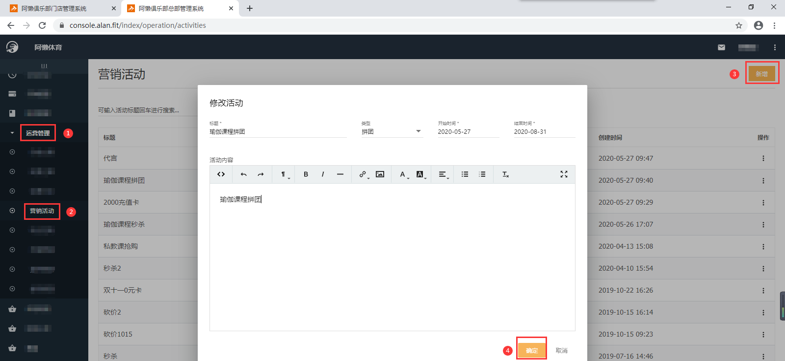
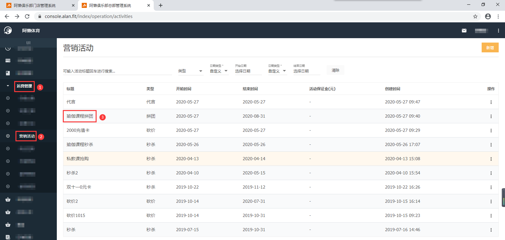
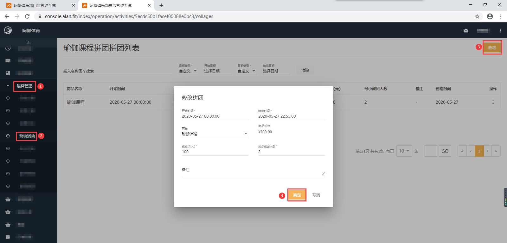
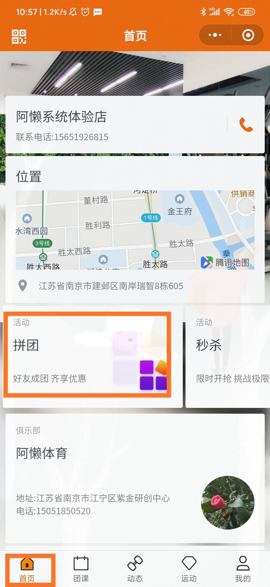
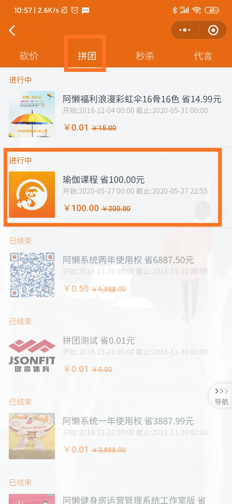
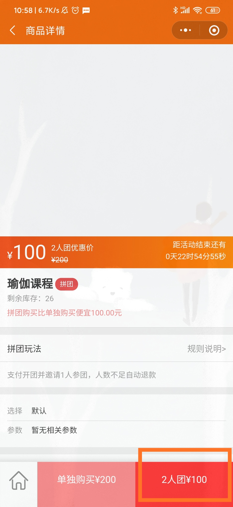
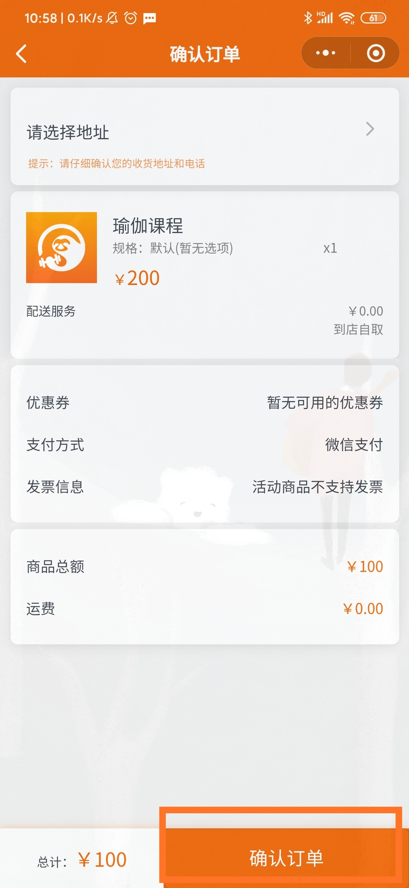

### 什么是拼团？

拼团就是通过平台使会员之间联合起来组团购买，打开页面点参团，规定的时间内人数凑齐后为组团成功，价格相对优惠一些。

### 怎么配置拼团活动？

以‘瑜伽课程’拼团为例：

- 先配置拼团的‘瑜伽课程’：【总部系统-科目管理-新增】，配置方法详见：《[设置私教课](https://alanfit.github.io/AlanHelpDoc/阿懒俱乐部版本/私教课/设置私教课)》；
- 再配置对应的拼团商品：【总部系统-在线商城-商品管理】

- 配置拼团的标题、类型、秒杀日期、活动内容：【总部系统-运营管理-营销活动-新增】

- 新增拼团的商品、开始时间、结束时间、成交价、最少成团人数：【总部系统-运营管理-营销活动-点击标题名称-右上角新增】

- 在对应的时间段，会员登录阿懒会员微信小程序端即可参与拼团，先支付再找人拼团，如没有成功找到人拼团，钱会自动退回到原账户。

