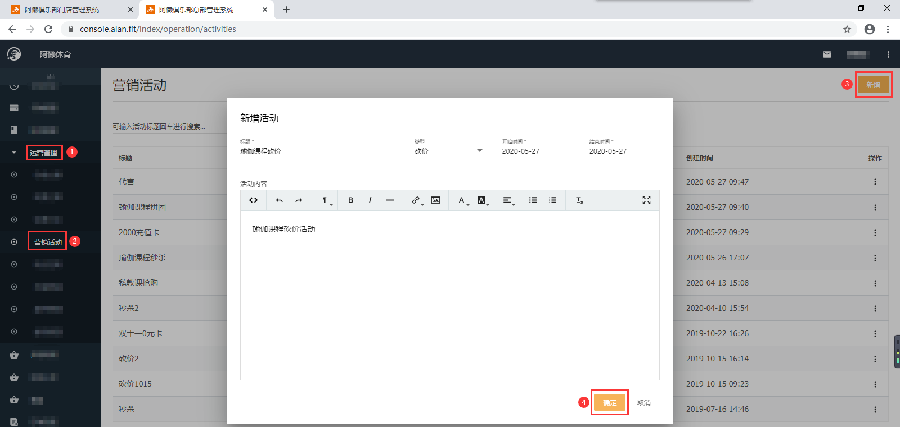
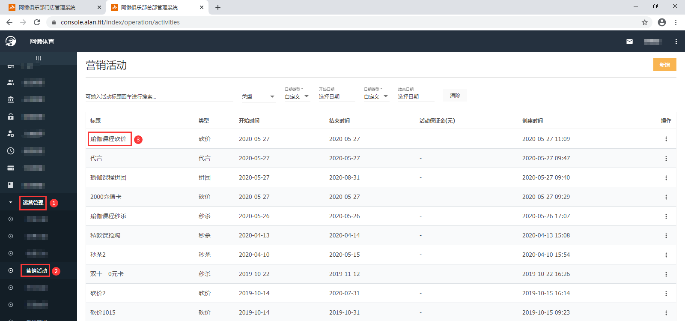
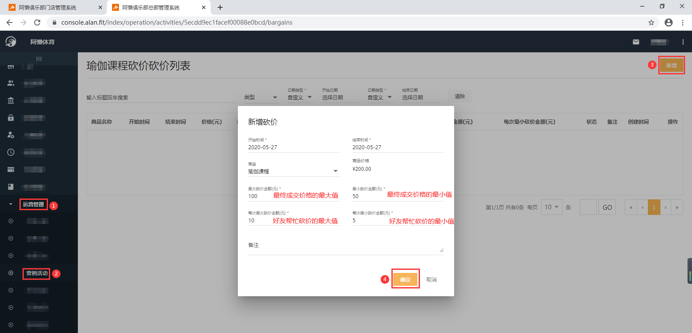
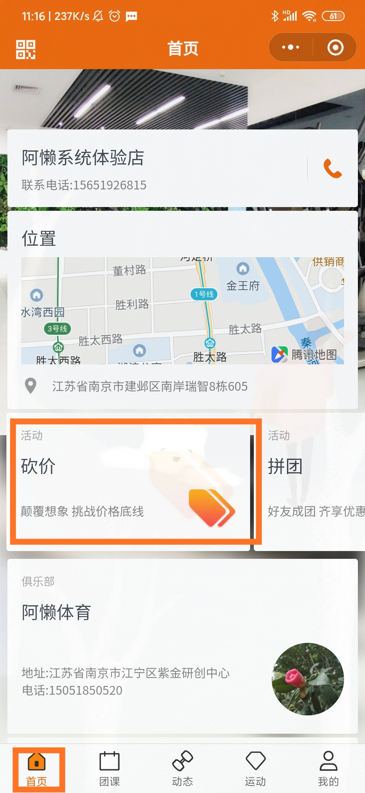
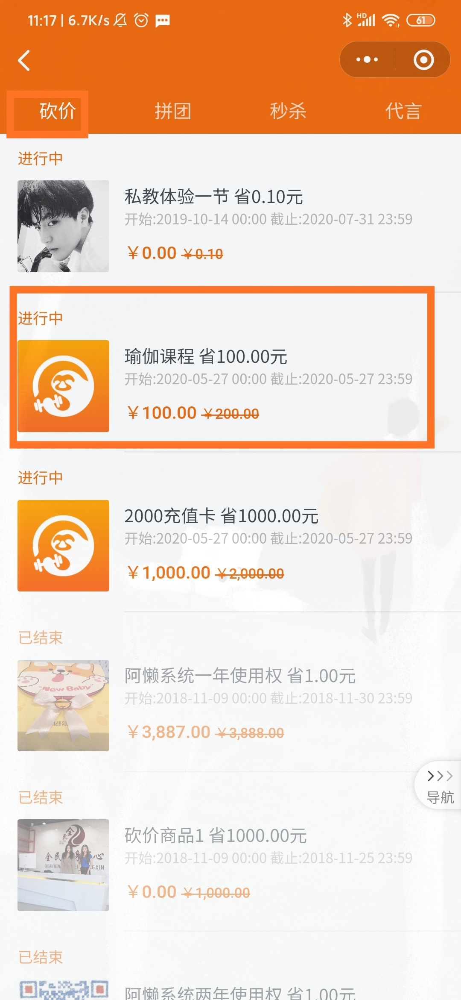
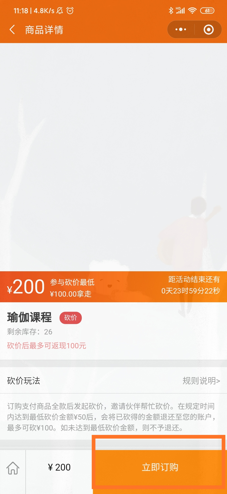
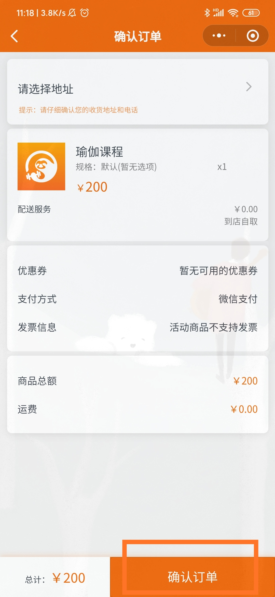

### 什么是砍价活动？

商家配置砍价活动，会员购买商品时，找到其他人帮自己砍价，以达到自己满意价位的行为。

### 怎么配置砍价活动？

以‘瑜伽课程’砍价为例：

- 先配置砍价的‘瑜伽课程’：【总部系统-科目管理-新增】，配置方法详见：《[设置私教课](https://alanfit.github.io/AlanHelpDoc/阿懒俱乐部版本/私教课/设置私教课)》；
- 再配置对应的砍价商品：【总部系统-在线商城-商品管理】

- 配置砍价的标题、类型、砍价日期、活动内容：【总部系统-运营管理-营销活动-新增】

- 新增砍价的商品、开始时间、结束时间、最大砍价金额、最小砍价金额、每次最大砍价金额、每次最小砍价金额：【总部系统-运营管理-营销活动-点击标题名称-右上角新增】

- 在对应的时间段，会员登录阿懒会员微信小程序端即可参与砍价活动，先支付原价，再找人帮忙砍价，最终会把砍价成功的价格退回至原账户。

