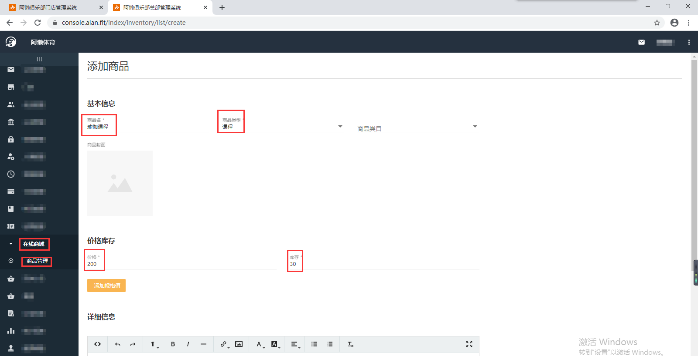
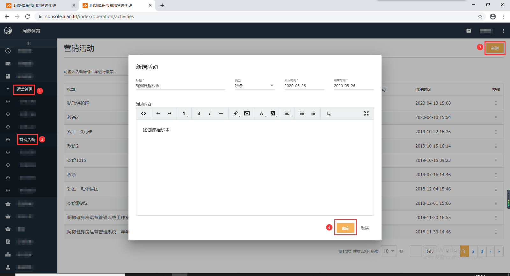
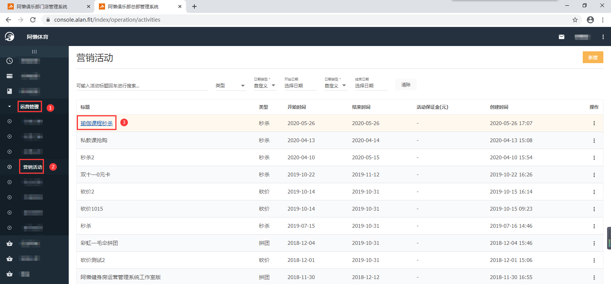
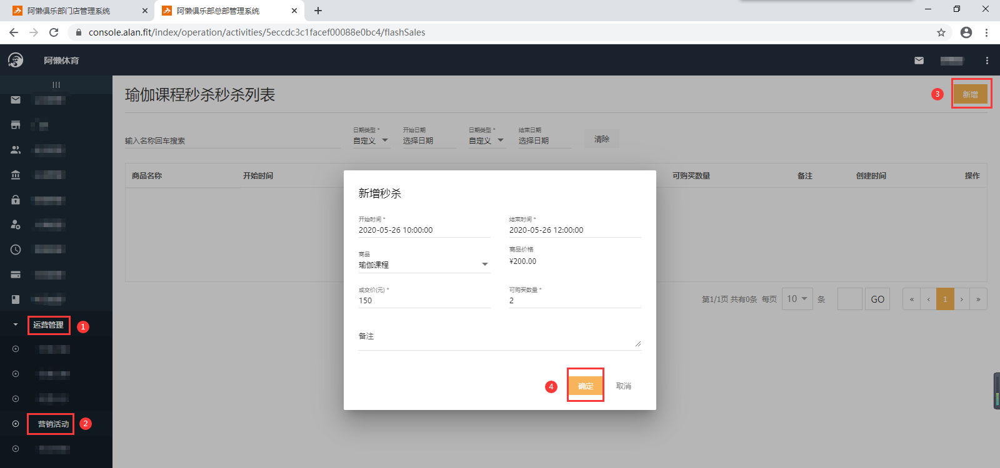
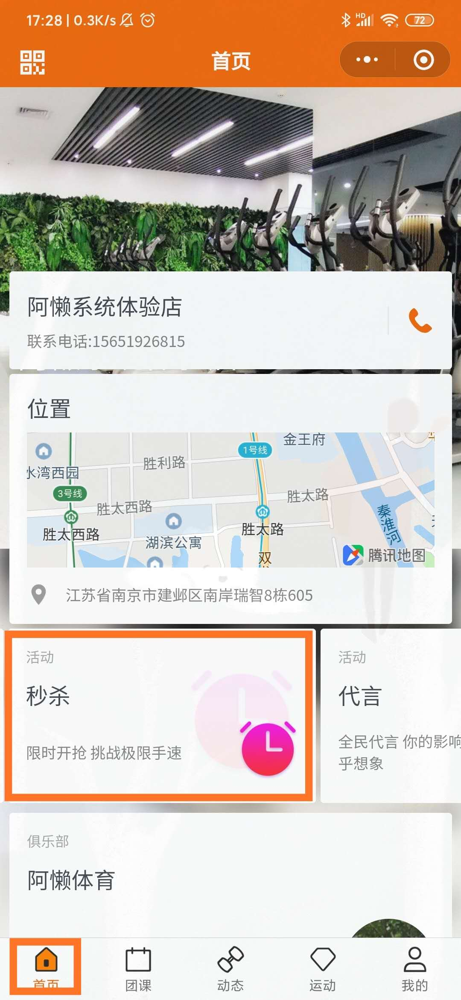
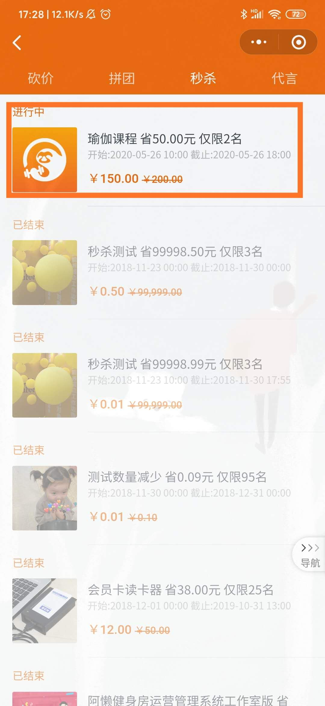
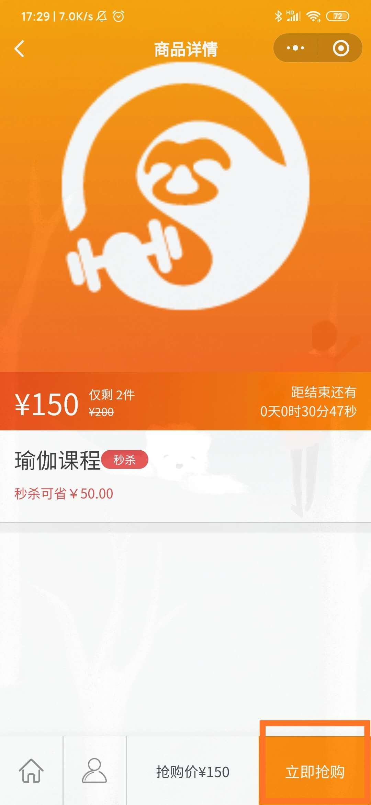
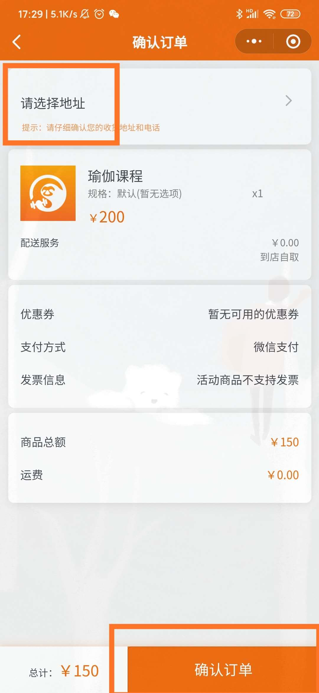

### 什么是秒杀？

所谓“秒杀”,就是健身房发布一些超低价格的商品,所有会员通过‘阿懒会员微信小程序’在同一时间抢购的一种销售方式。

### 怎么配置套餐？

以‘瑜伽课程’秒杀为例：

- 先配置秒杀的‘瑜伽课程’：【总部系统-科目管理-新增】，配置方法详见：《[设置私教课](https://alanfit.github.io/AlanHelpDoc/阿懒俱乐部版本/私教课/设置私教课)》；
- 再配置对应的秒杀商品：【总部系统-在线商城-商品管理】

- 配置秒杀的标题、类型、秒杀日期、活动内容：【总部系统-运营管理-营销活动-新增】

- 新增秒杀的商品、开始时间、结束时间、成交价、可购买数量：【总部系统-运营管理-营销活动-点击标题名称-右上角新增】

- 在对应的时间段，会员登录阿懒会员微信小程序端即可参与秒杀，支付成功后即可约课、上下课。

