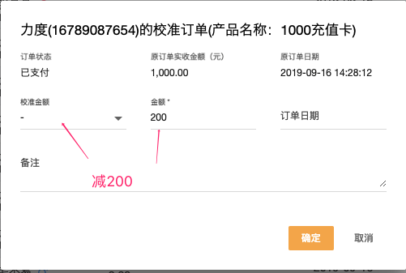

### 什么情况下需要订单校准？
操作失误，订单金额日期和实际不一致的时候

### 录入错误退掉重新录入也可以，为什么需要订单校准？
退掉重新录入也是可以的，但是比如办卡信息都是正确的，仅仅因为金额错误而产生财务的误差。
这个情况下退掉重新录入会产生退单，且信息都要重新录入一次，比较繁琐。
用订单校准可以快速修正财务上的误差

### 订单校准，原订单为什么没变化？
订单校准，系统并未修改原来的“错误”订单，而是生成了一个新的冲账订单

### 举例

  - 应收买卡实际收费1000元，订单录入完成后，发现收款写错为1200元
此时可以用订单校准，选择减200元，这样财务报表统计账目就正确了。

  - 2019年9月4日收的1000元款项，录入系统时候录错为2019年10月4日了。
   可以进行两次校准：第一次减掉10月4日1000元。第二次9月4日增加1000元。
   
  - 2019年9月1日多录入了一个收款100元，假设是定金或商品。2019年9月4日发现错误，并做了退定金或商品的操作。
  
    此时财务出现9月1日多了一个收款，9月4日多了个退款。
    
    可以进行两次订单校准来平账：
     - 9月1日，订单校准减去100，扣除多收的100
     - 9月4日，订单校准加上100，抵消100的退款
     
  