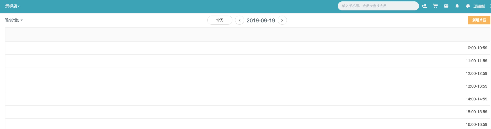
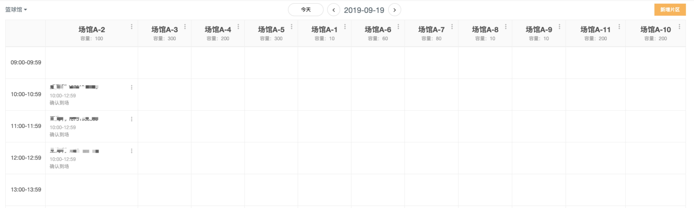
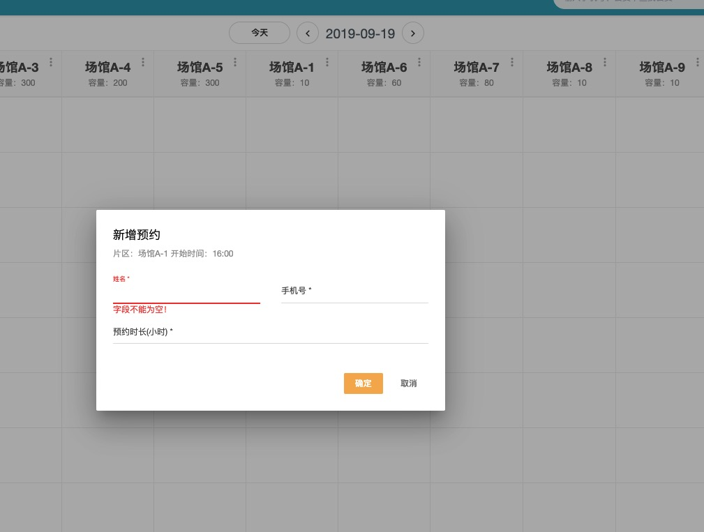
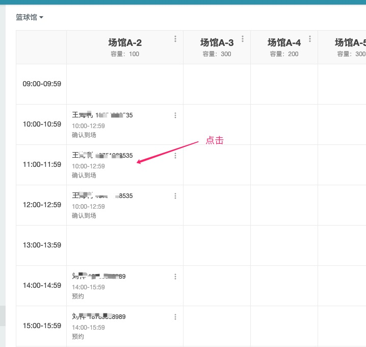
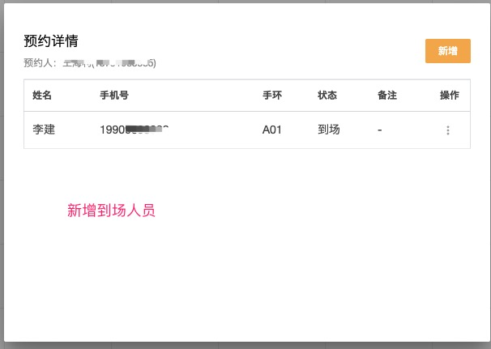
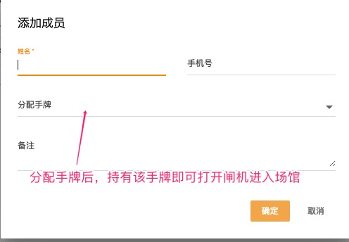

### 什么是场地
 - 对于俱乐部，指一些特殊用途的区域，比如私教区、团操室、瑜伽室等
 - 对于综合运动场馆，指具体的运动场馆，如 篮球场、羽毛球场、乒乓球台、足球场等

### 场地管理
菜单：门店--场地管理

 - 场地名称，如 瑜伽室、篮球场
 - 容纳人数，数字30人、10人
 - 开放时间、关闭时间，场地每天开关时间
 - 设备，如果场地有单独的闸机控制出入，需要选择智能设备中的闸机
 - 支持卡种，场地允许进入的卡种，比如篮球场，只允许持有“篮球100次卡”的会员进入
   默认支持所有卡种

### 场态管理
#### 片区管理
系统将场地中某一个小区域称为片区，如羽毛球馆有个8个球场，可以定义为8个片区

在场地列表中，点击场地名称，进入如下图界面：

点击新增片区来创建具体的片区,新增后类似下图：

#### 场馆预约

系统以小时为单位进行切分，点击上图中空白区域即可预约，点击后：

#### 人员到场

以篮球场为例，预约后，来打球的会员会是很多个人，要进行到场操作：

可以查看已经到场的人员

且可以新增到场人员

### 场馆预约中的手牌和闸机
假设篮球馆有闸机，需要给预约的会员分配手牌才能刷闸机入场，需要注意以下几点：

- 场地需要选择设备
- 手牌需要录入系统并录入手牌的芯片号，参考 [手牌管理](./手牌管理.md)
- 人员到场操作时需要分配手牌（见上文以及截图）。